# Advanced LangGraph: Multi-Agent Architectures & Subgraphs

*Weeks 3–4 — Advanced Design Patterns & Tooling*

## Introduction

Welcome to Weeks 3–4 of your advanced AI Engineering curriculum. You already know how to build basic state machines, route conditionally, persist memory with checkpointers, stream tokens, and pause execution for human review. That is the foundation. This module is about graduating from single-agent workflows to **production-grade Multi-Agent Systems (MAS)**.

A single LLM prompted to "do everything" fails predictably: it hallucinates tool arguments when given too many tools, forgets instructions buried in a 4,000-token system prompt, loops without knowing when it's done, and produces a system nobody can debug when it breaks in production at 2 AM. The fix is not a bigger prompt — it's **agentic decomposition**: splitting a complex job into specialized, narrowly-scoped agents that collaborate through a well-designed shared state, orchestrated by an explicit control layer you can reason about, trace, and test independently.

This document is your definitive handbook for designing, building, debugging, and extending multi-agent architectures using LangGraph. It is built around one complete, runnable project — a **Research Assistant Team** — and every architectural decision made along the way is explained with its trade-offs, not just its mechanics.

A note on API style: LangGraph has converged on the **`Command`** object (`langgraph.types.Command`) as the idiomatic way for a node to simultaneously update state *and* declare where control goes next, replacing the older pattern of returning a plain dict and routing separately with `add_conditional_edges`. This document uses `Command`-based routing throughout — including in the supervisor — because it collapses "what changed" and "what happens next" into one auditable return value per node, which is exactly the property you want when debugging a multi-agent trace at 2 AM.

## Learning Objectives

By the end of this module you will be able to:

- Choose between Router, Manager, Supervisor, and Hierarchical Team architectures based on task shape, not habit.
- Compose graphs using Subgraphs, Parent Graphs, and Child Graphs, and know exactly when a subgraph earns its complexity budget.
- Design a State schema with correctly scoped Shared vs. Private fields and correct reducers.
- Implement `Command()`-based routing, `Send()`-based parallel fan-out (map-reduce), and `interrupt()`/resume-based human-in-the-loop checkpoints.
- Build a production-ready Research Assistant Team (Supervisor + Search Agent + Writer Agent) with real tool integration, retries, and error handling.
- Test, observe, deploy, and scale a multi-agent system, and recognize the anti-patterns that quietly turn a MAS into an unmaintainable mess.

## Architecture Overview

### Why Multi-Agent Instead of One Large Agent?

| | Single Large Agent | Multi-Agent System |
|---|---|---|
| Prompt size | Grows unbounded as features are added | Each agent's prompt stays small and focused |
| Tool count per call | Often 15-30+, causing wrong-tool selection | 1-5 tools per agent, scoped to its job |
| Failure blast radius | One bad tool call can derail the entire conversation | Failure is isolated to one agent; supervisor can retry or reroute |
| Debuggability | One giant trace, hard to tell which "part" of the brain failed | Each agent is a separate trace span with a name |
| Extensibility | Adding a capability means editing one already-overloaded prompt | Add a new node + update supervisor's routing table |
| Parallelism | None — it's one sequential reasoning stream | Independent sub-tasks can run concurrently via `Send()` |

The underlying principle is **separation of concerns**, the same reason you don't write a 3,000-line function in normal software engineering. An LLM call is a function with a very expensive, very fuzzy body — the same discipline applies, arguably more so, because the "compiler" (the model) is probabilistic and degrades non-linearly with prompt complexity.

**You already have a live example of the left column of that table.** Open `core/graph/graph.py`: `GraphBuilder.build()` creates exactly one node, `chatbot`, and binds it to four tools at once — `get_weather`, `get_google_search`, `get_news`, `save_preference` (line 24). Today that's fine; four small, unrelated tools rarely get confused for one another. But watch what happens as this assistant grows: add `send_email`, `create_calendar_event`, `search_internal_docs`, and a couple more, and the single `chatbot_node` in `core/graph/nodes.py` starts hitting the exact failure modes in the left column — the system prompt in `create_chatbot_node` (currently one paragraph mentioning `user_preferences`) has to grow to disambiguate ten tools instead of four, and a bad `save_preference` call has just as much power to derail the conversation as a bad `get_news` call. The Research Assistant Team you're about to build is the concrete instance of the right column: two narrowly-scoped agents (`search_agent` with 2 tools, `writer_agent` with 0 tools) instead of growing the one `chatbot` node further.

**When a single agent is still the right call:** the existing `chatbot` node is a good example of *this*, too — general-purpose chat with a handful of well-differentiated tools is genuinely one skill (converse, reach for a tool when needed), so it doesn't need a supervisor. Reach for MAS when the task decomposes into *qualitatively different skills* (searching vs. writing vs. reviewing, which is exactly what "research a topic and write it up" requires) or when you need isolation for cost, latency, or reliability reasons — e.g., you want the Search Agent on a fast/cheap model and the Writer Agent on a more capable one, which isn't expressible with one `chatbot_node` sharing a single `LLMManager` instance.

## Theory

### The Vocabulary of Multi-Agent LangGraph

Each term below is defined against the system you're actually going to build, `core/graph/research/*`, so you can point at a real line of code for every concept rather than holding it as an abstraction.

- **Task Delegation** — `core/graph/research/supervisor.py`'s `supervisor()` handing off to `search_agent` via `Command(goto="search_agent")` the moment it sees `search_results` is still empty. Nothing is "called" — control is routed.
- **Agent Communication** — `search_agent` never talks to `writer_agent` directly. It writes `search_results` into `ResearchState` via `Command(update={"search_results": ...})`; `writer_agent` reads that same field on its next turn. This is intentional (see "Why not direct communication?" below).
- **Shared State** — every field in `ResearchState` (`core/graph/research/state.py`): `messages`, `question`, `search_results`, `draft`, `final_answer`. All four nodes in the graph can read and write these.
- **Private State** — the raw, unsummarized list returned by `get_google_search`/`get_news` inside `search_agent`'s tool-call resolution loop. It's used locally to build `summary`, and only `summary` ever crosses into `ResearchState` — the raw payload never becomes a field anyone else reads.
- **Graph Isolation** — if you build the optional hierarchical extension (Step 11, `team_subgraph.py`), whatever the Research Team's internal supervisor does mid-run stays invisible to a hypothetical top-level graph; only the fields matching `ResearchState`'s schema cross the boundary.
- **Graph Composition** — `ResearchGraphBuilder.build()` (`core/graph/research/graph.py`) composing `supervisor`, `search_agent`, `writer_agent` into one `StateGraph`; the same composition, one level up, is what Step 11's `team_subgraph.py` demonstrates by nesting that whole compiled graph as a single node.
- **Message Passing** — every `Command(update={"messages": [HumanMessage(..., name="search_agent")]})` call. Distinct from the `search_results`/`draft` fields, which are typed state, not messages (see the next section for why that distinction matters).
- **Orchestration** — `supervisor()` is the entire orchestration layer for this graph: three `if`/`elif`-style checks against `ResearchState`, no LLM call, deciding `search_agent` vs. `writer_agent` vs. `END`.

### Agent Responsibilities — Defining the Contract

Before writing a single node, write down each agent's contract as explicitly as you would an API's. For the Research Assistant Team:

| Agent | Reads from state | Writes to state | Tool access | Never does |
|---|---|---|---|---|
| Supervisor | `search_results`, `draft`, `revision_count` | `final_answer`, routing (`Command.goto`) | none | generate content, call an LLM for anything but (optionally) routing |
| Search Agent | `question` | `search_results` | `get_google_search`, `get_news` | write prose meant for the end user, decide when the task is "done" |
| Writer Agent | `question`, `search_results` | `draft` | none | invent facts absent from `search_results`, call external tools |
| Reviewer Agent | `search_results`, `draft` | `revision_count`, routing | none | rewrite the draft itself — it only judges and routes |

Writing this table *before* code is the cheapest design review you'll ever do — it surfaces coupling ("wait, does the Writer really need raw search results, or just the summary?") and scope creep ("why does the Search Agent have a `final_answer` write?") before either becomes a debugging session. It also becomes the spec each node's unit tests are written against.

### Message Passing vs. Typed State Fields

LangGraph gives you two distinct communication channels, and conflating them is a common source of confusion:

- **The `messages` channel** — a running, LLM-consumable conversation log (`Annotated[list[AnyMessage], add_messages]`). Use it for anything a *human or an LLM-driven supervisor* needs to read as natural-language context, and for anything you want visible in a chat-style UI.
- **Typed state fields** (`search_results: str`, `draft: str`, ...) — structured, single-purpose data channels. Use these for anything a *downstream node's code* needs to read programmatically (`if not state.get("search_results")`), because parsing structured data back out of a free-text message log is fragile and wasteful.

A well-designed graph uses `messages` for the human-facing narrative and typed fields for the machine-facing control flow — this repo's `ResearchState` does both: `search_results`/`draft`/`final_answer` drive the deterministic Supervisor's routing, while `messages` accumulates a readable trace of what each agent said, useful for LangSmith and for any future LLM-driven supervisor variant.

### Failure Handling as a First-Class Design Concern

Treat "what happens when this node fails" as part of the node's specification, not an afterthought bolted on after a production incident. Three questions to answer for every agent before it ships:
1. **What does "failure" look like for this specific agent?** (empty search results vs. a tool exception vs. a malformed structured-output response are three different failures with three different correct responses.)
2. **Is the failure transient or structural?** A timeout is usually transient (retry helps); a consistently malformed API response from a misconfigured tool is structural (retrying won't help — surface the error).
3. **Who decides what happens next — the node itself, or the Supervisor?** Generally: a node should handle its *own* transient failures internally (retry a tool call) and report structural failures upward via state (so the Supervisor, which has the global view, decides whether to reroute, degrade, or terminate).

You don't have to imagine this distinction — it's already inconsistently applied in your own tool layer. Open `core/tools/news.py`: `get_news` wraps its Tavily call in `try/except` and returns `f"Unable to reach the news service: {e}"` on failure — a transient-failure-handled-locally tool, exactly per question 3 above. Now open `core/tools/search.py`: `get_google_search` has no `try/except` at all around `search.results(query=topic)` — a `requests` exception from Serper today propagates straight out of the tool, into `search_agent`, and crashes the whole graph run. That's the concrete bug this section is warning you about, sitting in the codebase right now, and it's exactly what Step 2 of the Complete Project section asks you to fix before wiring `search_agent` up.

### Why Not Direct Agent-to-Agent Communication?

It's tempting to imagine agents as microservices calling each other's APIs directly (Agent A invokes Agent B, waits, gets a response). LangGraph deliberately does not encourage this. Instead, **all communication is mediated through state passed via the graph's execution engine**. Reasons:

1. **Observability** — every state transition is a checkpoint. If agents called each other out-of-band, LangSmith/your tracer would lose visibility into who changed what and when.
2. **Resumability** — because state transitions go through the graph, you get checkpointing, interrupt/resume, and time-travel debugging for free. Direct calls bypass all of that.
3. **Determinism of control flow** — the graph's edges are the single source of truth for "what can happen next." Direct calls create a hidden, undocumented second control-flow graph that nobody can see in the visualization.
4. **Testability** — you can unit test a node as a pure function `f(state) -> Command`. Direct inter-agent calls turn nodes into stateful objects with side-effecting collaborators, which is much harder to test in isolation.

Concretely: `search_agent` (`core/graph/research/search_agent.py`) could, in principle, `from core.graph.research.writer_agent import writer_agent` and call it directly once it has a summary, skipping the Supervisor entirely. Don't. If you did, `core/graph/graph.py`'s `graph.get_graph().draw_mermaid_png()` call (already used by the existing chatbot `GraphBuilder`) would render a diagram showing `search_agent → supervisor` as the only edge, while the real, undocumented control flow secretly also goes `search_agent → writer_agent` — the diagram would be lying to you, and so would every LangSmith trace, the first time you're debugging why the Supervisor's routing table doesn't seem to match what actually happened.

## Design Patterns

Four standard orchestration shapes cover the vast majority of real systems:

1. **Router Pattern** — a single classification step sends the request to exactly one specialist, which then terminates the graph. Simple, cheap, but no support for multi-step workflows — it's a dispatch table, not an orchestrator.
2. **Manager Pattern** — an agent builds an explicit step-by-step plan up front (e.g., `["search", "search", "write", "review"]`), then executes it deterministically, checking off each step. More predictable than a Supervisor, less flexible when the plan needs to change mid-flight.
3. **Supervisor Pattern** — a dynamic orchestrator that re-evaluates the *entire current state* after every step and decides the single next action, including when to stop. This is the pattern this module builds around, because it degrades gracefully when the task shape is not fully known in advance.
4. **Hierarchical Agent Teams** — a "supervisor of supervisors." Each team is itself a full multi-agent subgraph exposed to the parent as a single opaque node. Used when a single supervisor would need to track too many specialists to route reliably (rule of thumb: past ~6-8 direct reports, split into teams).

Router vs. Supervisor is the same trade-off as a `switch` statement vs. a state machine: pick a router when the task is genuinely single-step classification-and-dispatch, and a supervisor when the number of steps or their order is not knowable ahead of time.

**Router in code** — a router is a Supervisor with no return path: each specialist routes straight to `END` instead of back to the orchestrator. This app is actually a natural candidate for one: right now you have two separate compiled graphs — the existing single-agent `chatbot` graph (`core/graph/graph.py`) for casual conversation, and the new multi-agent `research_graph` (`core/graph/research/graph.py`) for deep research. A router is exactly the pattern that would let a CLI session use *both*, picking per-turn:

```python
# a hypothetical top-level router, if you decide to unify the two graphs behind one CLI entry point
from typing import Literal
from langgraph.types import Command

def route_query(state) -> Command[Literal["chatbot", "research_team"]]:
    is_research_task = classify_intent(state["messages"][-1].content)  # single classification call
    return Command(goto="research_team" if is_research_task else "chatbot")

# "chatbot" and "research_team" (the compiled research_graph, used as a subgraph node --
# see Hierarchical Teams below) each route straight to END; there is no "return to
# route_query" edge, because a router never re-evaluates.
```

Note this is presented as a hypothetical, not something you need to build now — today, choosing "casual chat" vs. "research" is a decision your CLI entry point can make explicitly (e.g., a `/research` command vs. plain chat), which is simpler than a classification-based router and arguably better until you have evidence users can't self-select correctly.

**Manager in code** — a manager commits to a plan up front and executes it as a queue, rather than re-deciding after every step. You'll build a real, lightweight instance of this in Step 8 of the Complete Project section: `planner_agent` calls the LLM exactly once to produce `sub_questions`, then `dispatch_search` mechanically fans out one `search_agent` `Send()` per sub-question — no re-planning mid-flight, no re-evaluating whether the plan still makes sense once results start coming back. Written in the more general queue-of-steps shape a Manager usually takes:

```python
def manager(state: PlanState) -> Command[Literal["execute_step", "__end__"]]:
    if "plan" not in state or not state["plan"]:
        plan = build_plan(state["goal"])  # one-time planning call -- this is what planner_agent does
        return Command(update={"plan": plan, "completed_steps": []}, goto="execute_step")
    if len(state["completed_steps"]) >= len(state["plan"]):
        return Command(goto=END)
    return Command(goto="execute_step")

def execute_step(state: PlanState) -> Command[Literal["manager"]]:
    next_step = state["plan"][len(state["completed_steps"])]
    result = run_step(next_step)  # dispatches to the right specialist for this step type
    return Command(update={"completed_steps": state["completed_steps"] + [result]}, goto="manager")
```

The Manager's `plan` is committed once and then mechanically walked — contrast with your `supervisor()` in `core/graph/research/supervisor.py`, which re-derives "what's next" from scratch on every hop by re-checking `search_results`/`draft`, and could therefore react to, say, a search coming back empty in a way a committed-up-front plan can't without extra plumbing.

## Supervisor Pattern

### How It Works

1. The Supervisor node reads the current `state` — not just the latest message, but every field agents have populated so far (`search_results`, `draft`, etc.).
2. It applies deterministic or LLM-driven logic to decide which agent should act next, or whether the task is complete.
3. It returns a `Command` that both encodes the routing decision (`goto=...`) and, optionally, updates shared state (`update={...}`).
4. Control transfers to the chosen agent, which does its job and returns its own `Command` — typically routing back to the Supervisor.
5. This repeats until the Supervisor decides to route to `END`.

**Two supervisor implementation styles**, and when to use each:

- **Deterministic supervisor** (plain Python `if`/`elif` on state fields) — cheap, fast, fully predictable, zero extra LLM calls. Use this whenever the routing decision can be expressed as a function of *what state fields are already populated* — which is true for a huge fraction of real pipelines, including this module's Research Assistant Team.
- **LLM-driven supervisor** (structured output routing) — necessary when the *next step depends on the semantic content* of what an agent produced (e.g., "should we search again because the results were insufficient, or move to writing?"). Costs a model call per hop and introduces non-determinism into your control flow, so use it only where the decision genuinely requires judgment.

This module implements the deterministic style first (matching the scaffold already in this repository at `core/graph/research/supervisor.py`), then shows the LLM-driven variant as an extension.

**Advantages:** highly dynamic, handles unanticipated paths, trivial to add a new specialist (one new `elif` branch or routing option) without touching existing agents.

**Disadvantages:** an LLM-driven supervisor can loop if it doesn't recognize task completion; requires either careful state-field bookkeeping (deterministic style) or a capable model with structured output (LLM style).

## Hierarchical Teams

A single supervisor with 15 specialist nodes is itself an anti-pattern — the supervisor's prompt (if LLM-driven) or its branching logic (if deterministic) becomes the new monolith. The fix is **hierarchical composition**: group specialists into teams, give each team its own supervisor, and expose the *team* as a single node to a top-level supervisor.

Here's what that looks like concretely for this app, if you later combine the existing single-agent `chatbot` graph with the new `research_graph` behind one top-level entry point instead of choosing between them at the CLI level:

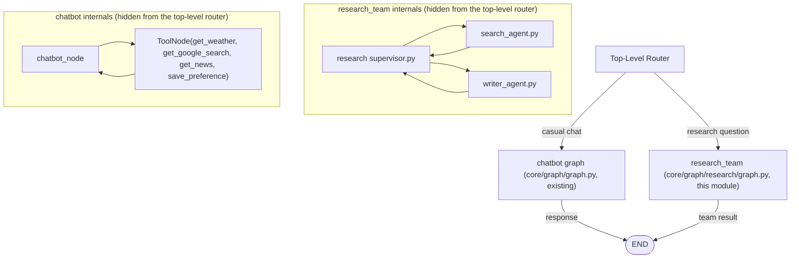

The top-level router never sees `search_agent`, `writer_agent`, `get_weather`, or `save_preference` directly — it only sees `chatbot` and `research_team` as two callable nodes, each of which is itself a compiled `StateGraph`. This is the same reason you'd refactor a 500-line function into smaller functions in normal software: managing cognitive load, this time for both you *and* (for an LLM-driven router) the model reading the routing prompt. It's also, concretely, how you'd resolve a naming/schema collision if `GraphState` (the chatbot's state, `core/graph/state.py`) and `ResearchState` (`core/graph/research/state.py`) ever needed to coexist behind one entry point: each subgraph keeps its own schema internally, and only a thin top-level `TypedDict` (maybe just `messages` plus a `route` field) needs to satisfy both.

## Subgraphs

A **subgraph** is a `StateGraph` that has been `.compile()`-d and is then added as a node in a *different* `StateGraph`, using `builder.add_node("team_name", compiled_subgraph)`.

- **Graph Invocation** — when the parent's execution reaches a subgraph node, the parent's runtime hands control (and mapped state) to the subgraph's own execution loop. The parent is "paused" (in the sense of that branch of execution) until the subgraph reaches its own `END`.
- **State Passing** — if the subgraph's `TypedDict` schema is a strict subset of the parent's (same key names, same types), LangGraph passes state automatically. If schemas differ, you write a small wrapper node that maps parent fields to the subgraph's input schema and maps subgraph output back to parent fields — this is the standard way to keep a subgraph's private fields (e.g., raw scratch notes) from ever entering the parent's state.
- **State Merge** — whatever the subgraph returns is merged into the parent state using the parent's own reducers. If both parent and subgraph use `add_messages` on a `messages` key, messages naturally accumulate as execution crosses the boundary.
- **Interrupt/Resume across boundaries** — an `interrupt()` called *inside* a subgraph propagates up and pauses the *entire* execution stack, not just the subgraph. Resuming (`Command(resume=...)`) at the parent level re-enters exactly where the subgraph left off, because the checkpointer stores state for the full nested execution, not just the top level.

### `Command()` — Update + Route in One Return Value

```python
from langgraph.types import Command
from typing import Literal
from core.graph.research.state import ResearchState

def writer_agent(state: ResearchState) -> Command[Literal["supervisor"]]:
    # do work... (the real version is Step 5 of the Complete Project section)
    return Command(
        update={"draft": "new draft text"},  # merged into ResearchState via its reducers
        goto="supervisor",                    # explicit control-flow edge
    )
```

`Command` replaces the two-step "return a dict, then let a separate `add_conditional_edges` function inspect it and route" pattern — notice `core/graph/research/graph.py`'s `ResearchGraphBuilder.build()` has no `add_conditional_edges` call at all, unlike the existing chatbot graph (`core/graph/graph.py:38`, `add_conditional_edges("chatbot", tools_condition)`), precisely because every research-team node already declares its own routing via `Command`. The `Literal["supervisor"]` type hint on the return type is not decorative — LangGraph's graph-drawing tool (the same `draw_mermaid_png()` call `core/graph/graph.py` already uses to emit `graph.png`) reads it to render the correct edges in visualizations, and your type checker uses it to catch typos in `goto` targets.

### `Send()` — Dynamic Parallel Fan-Out (Map-Reduce)

`Send` lets a single node dispatch *N* parallel invocations of another node, each with its own slice of state — the LangGraph equivalent of `map()` followed by an automatic `reduce` via your state's reducers.

```python
from langgraph.types import Send

def dispatch_searches(state: ResearchState):
    return [
        Send("search_agent", {"question": sub_q, "messages": []})
        for sub_q in state["sub_questions"]
    ]
```

Each `Send("search_agent", {...})` spins up an independent, isolated execution of the `search_agent` node with the given state payload. All of them run concurrently; when they all complete, their outputs are merged back into the parent state field-by-field using each field's reducer (e.g., a list field with an `operator.add` reducer accumulates one entry per parallel branch).

### `interrupt()` and Resume — Human-in-the-Loop

```python
from langgraph.types import interrupt, Command
from typing import Literal
from core.graph.research.state import ResearchState

def writer_agent(state: ResearchState) -> Command[Literal["supervisor", "writer_agent"]]:
    draft = generate_draft(state)
    approved = interrupt({"draft_for_review": draft})  # pauses execution here
    if not approved:
        return Command(goto="writer_agent")  # loop back for a rewrite
    return Command(update={"draft": draft}, goto="supervisor")
```

`interrupt(payload)` freezes the graph at exactly this point and surfaces `payload` to the caller. The graph is only resumable via `research_graph.invoke(Command(resume=user_input), config)` using the *same* `thread_id` — which is why a persistent checkpointer is mandatory for any graph using `interrupt()`. This is the one piece of infrastructure this repo already has ready to go: `core/graph/checkpointer.py`'s `Checkpointer` wraps `AsyncSqliteSaver`, which is file-backed, not in-memory — so a `writer_agent` that pauses here survives the CLI process exiting entirely, with no Postgres/Redis migration needed to get human-in-the-loop working. Step 10 of the Complete Project section builds the full version of this against the real `writer_agent`.

### `START` and `END`

`START` and `END` are sentinel nodes, not real work — `START` is where `graph.invoke()` injects the initial state, and `END` is where execution halts and the final state is returned to the caller. Every path through a well-formed graph must be reachable from `START` and every terminal path must reach `END` (or raise, or hit the recursion limit) — a graph with a node that has no outgoing edge to `END` and no cycle back to a routing decision point is a bug, not a feature.

## State Management

State is the *only* channel of communication between agents — get this wrong and everything downstream (isolation, testability, cost) suffers.

- **Overall / Shared State** — fields every node can read and write: `messages`, `question`, `final_answer`. Keep this minimal. Every field here is potential coupling between agents.
- **Private / Agent State** — fields scoped to one agent's internal reasoning, never read by other agents (e.g., raw unprocessed search-engine JSON before it's summarized into `search_results`). Implement this either as a separate `TypedDict` used only inside a subgraph, or as a key namespaced by agent name (e.g., `_search_agent_scratch`) that other agents are documented (and, ideally, typed) to never touch.
- **Reducers** — the mechanism that decides *how* a node's returned update combines with existing state, rather than blindly overwriting it. `add_messages` (append/dedupe-by-id for message lists) is the built-in you'll use constantly; `operator.add` is the general-purpose "concatenate" reducer for parallel `Send()` fan-in.

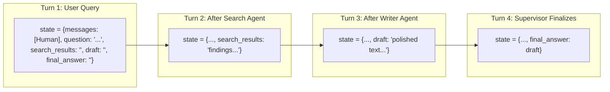

**Design rule of thumb:** if you find yourself wanting to store a field "just in case a future agent needs it," don't — add it when that agent exists. Unused state fields are the multi-agent equivalent of dead code, except they also cost tokens if they end up embedded in prompts.

## Mermaid Diagrams

### Graph Architecture — Research Assistant Team

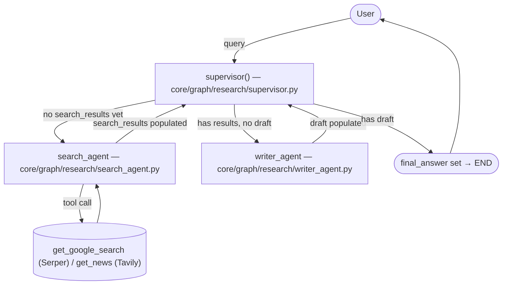

### Sequence Diagram — One Full Turn

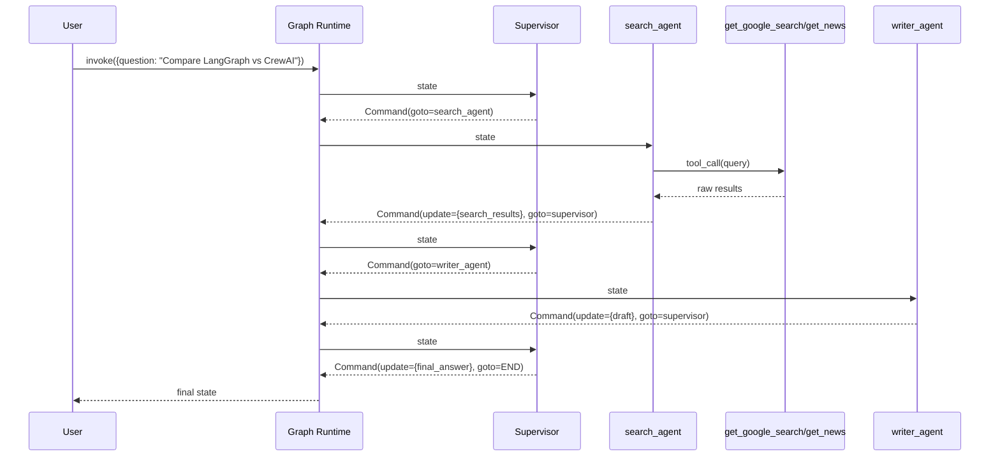

### Data Flow

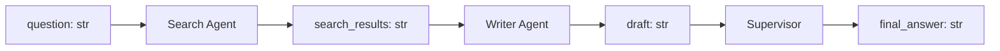

### Parent Graph / Child Graph (Nested)

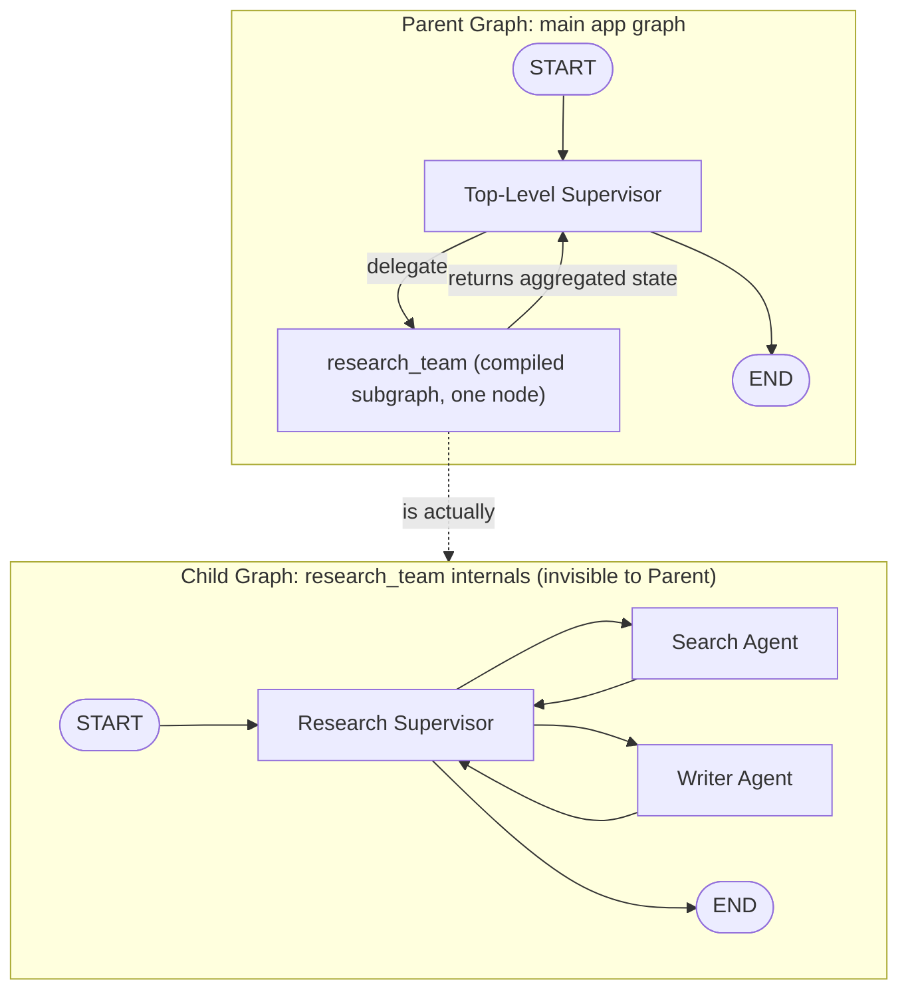

### Subgraph Execution / State Boundary

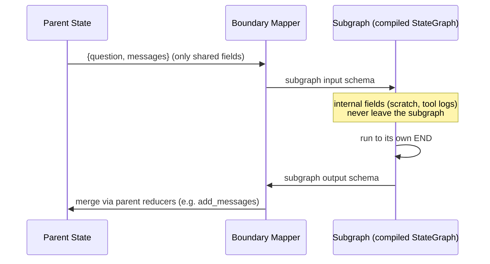

### Retry Flow

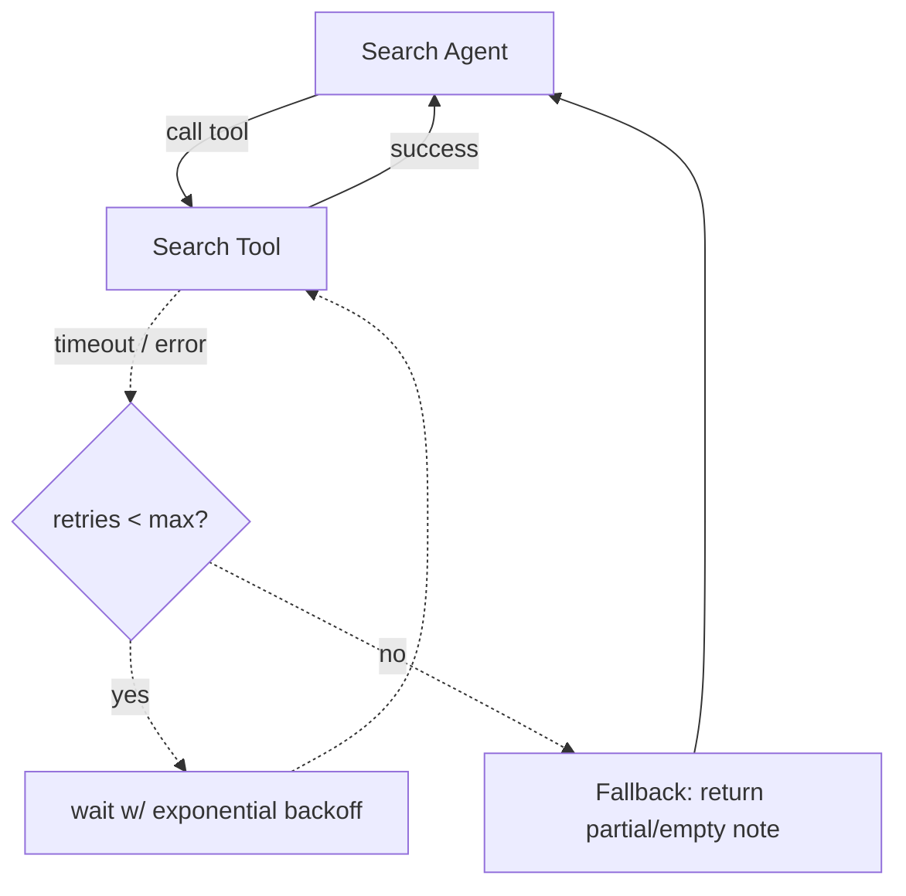

### Failure Flow

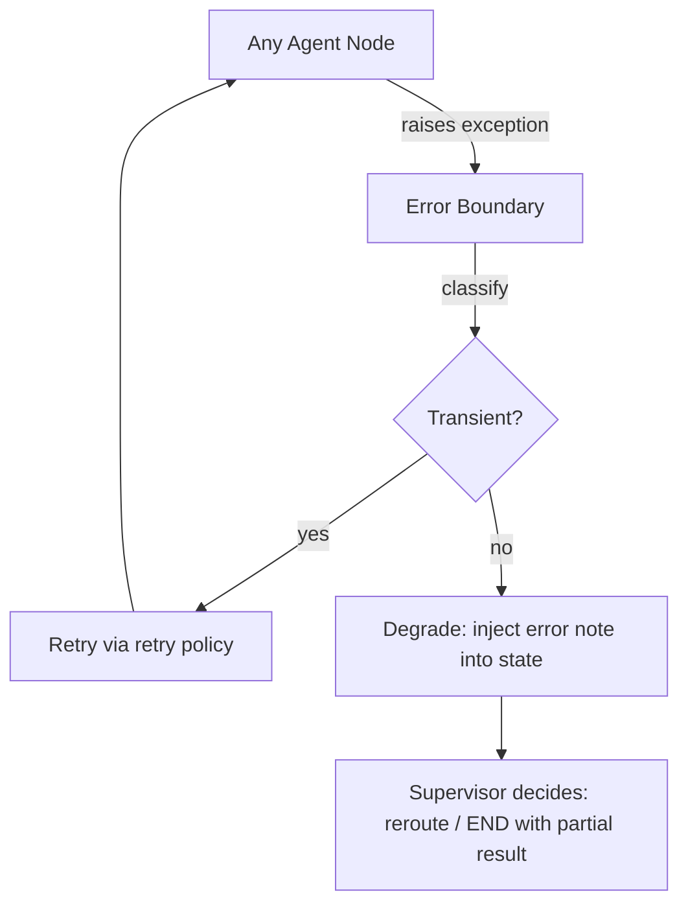

### Parallel Execution (Map-Reduce via Send)

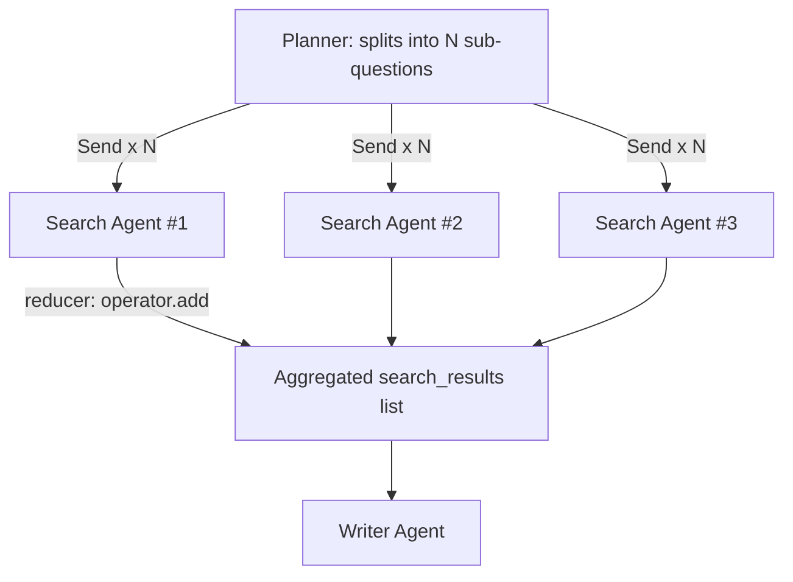

### Sequential Execution

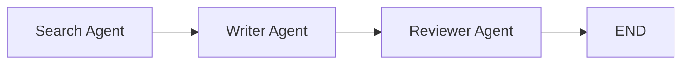

## Folder Structure

The generic pattern (`agents/<name>/{prompt,node}.py`, `services/llm.py`, `tools/`) is the ideal shape for a *standalone* project. This repo already has an equivalent structure at the `core/` level — separate `llm/`, `tools/`, `memory/`, `database/` packages — so the Research Team should slot into the existing convention rather than reinvent it. This is what the repo looks like once Step 0's cleanup and the new files from the Complete Project section are in place:

```text
langgraph-cli-chat-agent/
│
├── core/
│   ├── graph/
│   │   ├── graph.py              # existing: single-agent chatbot graph (GraphBuilder)
│   │   ├── nodes.py              # existing: chatbot_node, refiner_node
│   │   ├── state.py              # existing: GraphState for the chatbot graph
│   │   ├── router.py             # existing: chatbot graph's router
│   │   ├── checkpointer.py       # existing: Checkpointer (AsyncSqliteSaver) -- reused by both graphs
│   │   │
│   │   └── research/             # <- the Research Assistant Team lives here
│   │       ├── state.py          # existing, real: ResearchState
│   │       ├── supervisor.py     # existing, real: Command-based deterministic supervisor
│   │       ├── prompts.py        # new: SEARCH_AGENT_PROMPT, WRITER_AGENT_PROMPT
│   │       ├── search_agent.py   # new: search_agent() node
│   │       ├── writer_agent.py   # new: writer_agent() node
│   │       ├── planner_agent.py  # new, optional: Send()-based parallel search extension
│   │       ├── reviewer_agent.py # new, optional: bounded revision-loop extension
│   │       ├── team_subgraph.py  # new, optional: hierarchical composition extension
│   │       └── graph.py          # new: ResearchGraphBuilder, assembles the above
│   │
│   ├── llm/
│   │   └── manager.py            # existing: LLMManager (multi-provider, bind_tools, streaming)
│   │
│   ├── tools/
│   │   ├── search.py             # existing: get_google_search (Serper)
│   │   ├── news.py               # existing: get_news (Tavily)
│   │   ├── weather.py            # existing: get_weather
│   │   └── preferences.py        # existing: save_preference
│   │
│   ├── memory/                   # existing: session history, summarizer
│   ├── database/                 # existing: SQLAlchemy models/repositories
│   └── bootstrap.py              # existing: wires LLMManager + Checkpointer + services together;
│                                  #   add create_research_graph() here alongside create_chat_service()
│
├── config/settings.py            # existing: env var loading (serper_api_key, tavily_api_key, etc.)
├── tests/
│   ├── test_research_state.py    # new: reducer behavior tests
│   ├── test_research_nodes.py    # new: unit tests per node (pure function tests)
│   ├── test_research_graph.py    # new: integration tests running the compiled graph
│   └── test_research_failures.py # new: timeout / empty-result / hallucination test cases
│
└── (CLI entry point, wherever it currently lives)
```

**What changed from the generic pattern, and why that's fine:**
- No `agents/<name>/{prompt,node}.py` split — this repo already groups by *layer* (`llm/`, `tools/`, `graph/`) rather than by agent, so `core/graph/research/*_agent.py` as flat files matches the convention already established by `core/graph/nodes.py`.
- No `services/llm.py` — `core/llm/manager.py` already is that file.
- No new `tools/web_search.py` — `core/tools/search.py` + `core/tools/news.py` already are that file, split by provider/purpose instead of unified behind one function.
- `core/graph/research/` nests under the existing `core/graph/` package (next to the chatbot graph) rather than living at the project root, because this repo organizes by domain (`core/`) first, not by graph.

The one thing worth preserving from the generic pattern regardless of framework: **a dedicated failure-mode test file** (`test_research_failures.py`) rather than mixing failure-path tests into the general node tests — those get skipped/deprioritized when they're not visibly separate in CI output.

## Complete Project: Research Assistant Team

### Step 0 — Align With What's Already in This Repo

Before writing new code, resolve one thing: this repo currently has **two parallel, half-built scaffolds** for the same system. Pick one and delete the other so you're not maintaining duplicate state schemas.

| Location | Status | Verdict |
|---|---|---|
| `core/graph/research/state.py`, `core/graph/research/supervisor.py` | **Real, working code** — `ResearchState` TypedDict and a `Command`-based deterministic supervisor already match this module's design exactly | ✅ Keep this — it's canonical |
| `core/states/research_state.py` | Empty stub | ❌ Delete |
| `core/agents/search_agent.py`, `writer_agent.py`, `supervisor.py`, `planner_agent.py`, `reviewer_agent.py` | Empty stubs | ❌ Delete (we'll add the real ones under `core/graph/research/` instead) |
| `core/subgraphs/research_graph.py` | Empty stub | ❌ Delete |

```powershell
Remove-Item core\states\research_state.py, core\agents\search_agent.py, core\agents\writer_agent.py, core\agents\supervisor.py, core\agents\planner_agent.py, core\agents\reviewer_agent.py, core\subgraphs\research_graph.py
```

Everything below targets **`core/graph/research/`** as the single home for this feature, sitting alongside your existing single-agent chatbot graph (`core/graph/graph.py`, `core/graph/nodes.py`) rather than replacing it — you'll end up with two graphs in this app: the existing chatbot graph and this new research-team graph, invoked separately from the CLI.

**Also reuse, don't rebuild:**
- `core/tools/search.py` (`get_google_search`, Serper-backed) and `core/tools/news.py` (`get_news`, Tavily-backed) — this is your Search Agent's tool set. No new `web_search` tool needed.
- `core/llm/manager.py` (`LLMManager`) — already supports Google/OpenAI/Anthropic/Groq and exposes `.bind_tools()`, `.invoke()`, `.ainvoke()`. Use it instead of constructing a raw `ChatOpenAI`.
- `core/graph/checkpointer.py` (`Checkpointer`, wrapping `AsyncSqliteSaver`) — already persistent (survives process restarts), which is what `interrupt()`/resume needs. No `MemorySaver`/Postgres migration required to get started.

The code that follows is written against these real modules — copy it in directly.

### 1. `core/graph/research/state.py` — Extend the Existing File

```python
# core/graph/research/state.py — already exists, extend it as shown
from typing import Annotated
from langgraph.graph.message import add_messages
from langchain_core.messages import AnyMessage
from typing_extensions import TypedDict


class ResearchState(TypedDict):
    """Shared state for research operations."""
    messages: Annotated[list[AnyMessage], add_messages]
    question: str
    search_results: str
    draft: str
    final_answer: str
```

**Explanation:**
- This is exactly what's already sitting in `core/graph/research/state.py` — no changes needed to get started. Note the existing docstring calls it "Share state," but the fields are what matter.
- `messages` uses the `add_messages` reducer, so every node that returns `{"messages": [...]}` *appends* to history rather than overwriting it — critical, because multiple agents write to `messages` across the run and none of them should be able to erase what came before.
- `question`, `search_results`, `draft`, `final_answer` are plain fields with the default "last write wins" behavior, which is correct here because exactly one agent is ever responsible for setting each of them.
- Leave this file exactly as-is until you build the Planner + parallel search extension (Step 8 below), which is the point where `search_results` needs to become a list with an `operator.add` reducer.

### 2. Tools — Already Built, Bind Them Directly

No new tool file is needed. Your Search Agent's tool set is the two tools already implemented and error-handled:

```python
# core/tools/search.py — already exists
@tool("get_google_search", description="Get the latest news for a given topic.", return_direct=False)
def get_google_search(topic: str) -> dict:
    """Search Google (via Serper) for the given topic and return live search results."""
    return search.results(query=topic)
```

```python
# core/tools/news.py — already exists
@tool("get_news", description="Get the latest news for a given topic.")
async def get_news(topic: str):
    """Get the latest news for a topic (via Tavily)."""
    ...
```

**What to fix while you're here (two small pre-existing issues worth cleaning up, not blockers):**
- `get_google_search`'s docstring/description says "latest news" — copy-pasted from the news tool. Update it to describe general web search, since an LLM picks between `get_google_search` and `get_news` based on their descriptions, and identical descriptions make that choice a coin flip.
- `get_google_search` has no `try/except` around `search.results(...)`, unlike `get_news` and `get_weather` which both catch and return a string. Per the tool-integration rule in this module (a tool must never let a raw exception reach the graph), wrap it the same way:

```python
@tool("get_google_search", description="Search the web for general, up-to-date information on a topic.", return_direct=False)
def get_google_search(topic: str) -> dict | str:
    """Search Google (via Serper) for the given topic and return live search results."""
    try:
        return search.results(query=topic)
    except Exception as e:
        logger.exception("Google search tool failed")
        return f"Unable to reach the search service: {e}"
```

For the Search Agent, bind both:

```python
from core.tools.search import get_google_search
from core.tools.news import get_news

search_tools = [get_google_search, get_news]
```

The model picks between them per-call based on each tool's docstring — `get_google_search` for general/factual queries, `get_news` when the question is about recent events. This is the same "give the agent multiple tools and let tool-selection route between them" pattern the original design used for public-web vs. internal-docs search — you already have the two-tool version of it for free.

### 3. `core/llm/manager.py` — Already Built, Just Use It

```python
# core/llm/manager.py — already exists
from core.llm.manager import LLMManager
from config.enums import LLMProvider
from core.llm.models import SupportedModel

# Per-agent model construction -- pass provider/model explicitly per agent
# the same way core/bootstrap.py already does for the main chatbot:
search_llm = LLMManager(provider=LLMProvider.GOOGLE, model_name=SupportedModel.GEMINI_3_1_FLASH_LITE)
writer_llm = LLMManager(provider=LLMProvider.GOOGLE, model_name=SupportedModel.GEMINI_3_1_FLASH_LITE)
```

**Explanation:** there is no `services/llm.py` to add — `LLMManager` already centralizes provider selection, temperature, and streaming (see `core/llm/manager.py:26-118`), and `core/bootstrap.py` already shows the pattern of constructing one per role (`primary_llm = LLMManager(provider=LLMProvider.GOOGLE, ...)`). One difference from the generic version of this module: `LLMManager` doesn't currently expose a `timeout`/`max_retries` constructor argument the way the `ChatOpenAI` example did — if you want transport-level retry, that's a small addition to `LLMManager._create_model()`'s `common_kwargs` dict (most LangChain chat models accept `timeout=`/`max_retries=` directly), not something to bolt on separately.

`LLMManager.bind_tools(tools)` returns a tool-bound **raw chat model** (`self._model.bind_tools(tools)`), not another `LLMManager` — so in the Search Agent below you call `.bind_tools()` once at import time and use the returned object directly, exactly like the existing `create_chatbot_node` in `core/graph/nodes.py` already does (`tool_enabled_llm = llm.bind_tools(tools)`).

### 4. `core/graph/research/prompts.py` + `core/graph/research/search_agent.py` — Search Agent

```python
# core/graph/research/prompts.py (new file)
SEARCH_AGENT_PROMPT = """You are the Search Agent on a research team.

Your ONLY job is to find and summarize factual information relevant to
the user's question. You have access to `get_google_search` (general web)
and `get_news` (recent events).

Rules:
- Pick the tool that fits the question; call it with a focused query.
- If the first search is insufficient, refine and search again (max 2 searches).
- Never write a final answer for the user -- that is the Writer Agent's job.
- Output a concise, structured summary of findings: bullet points with
  the key facts and their sources. Do not add commentary or opinions.
- If all searches fail or return nothing useful, say so explicitly:
  "No reliable search results found for: <question>".
"""
```

```python
# core/graph/research/search_agent.py (new file)
from typing import Literal

from langchain_core.messages import HumanMessage
from langgraph.types import Command

from core.graph.research.state import ResearchState
from core.graph.research.prompts import SEARCH_AGENT_PROMPT
from core.llm.manager import LLMManager
from config.enums import LLMProvider
from core.llm.models import SupportedModel
from core.tools.search import get_google_search
from core.tools.news import get_news

search_tools = [get_google_search, get_news]
_llm = LLMManager(provider=LLMProvider.GOOGLE, model_name=SupportedModel.GEMINI_3_1_FLASH_LITE)
_llm_with_tools = _llm.bind_tools(search_tools)  # returns a bound chat model, not an LLMManager


async def search_agent(state: ResearchState) -> Command[Literal["supervisor"]]:
    messages = [
        {"role": "system", "content": SEARCH_AGENT_PROMPT},
        {"role": "user", "content": state["question"]},
    ]
    response = await _llm_with_tools.ainvoke(messages)

    # Resolve any tool calls synchronously within this node so the
    # Search Agent always returns a finished summary, not a pending
    # tool call, to the Supervisor.
    tool_outputs = []
    for call in getattr(response, "tool_calls", []) or []:
        tool_fn = next(t for t in search_tools if t.name == call["name"])
        result = await tool_fn.ainvoke(call["args"]) if call["name"] == "get_news" else tool_fn.invoke(call["args"])
        tool_outputs.append(f"[{call['name']}] {result}")

    if tool_outputs:
        followup = await _llm_with_tools.ainvoke(
            messages
            + [response]
            + [{"role": "tool", "tool_call_id": tc["id"], "content": out}
               for tc, out in zip(response.tool_calls, tool_outputs)]
        )
        summary = followup.content
    else:
        summary = response.content

    return Command(
        update={
            "search_results": summary,
            "messages": [HumanMessage(content=summary, name="search_agent")],
        },
        goto="supervisor",
    )
```

**Explanation:**
- `_llm.bind_tools(search_tools)` mirrors exactly what `create_chatbot_node` already does in `core/graph/nodes.py:24` (`tool_enabled_llm = llm.bind_tools(tools)`) — same call shape, different tool set and a narrower system prompt.
- `get_news` is defined `async def` in `core/tools/news.py`, while `get_google_search` is a plain sync `def` in `core/tools/search.py` — the `if call["name"] == "get_news" else` branch handles that mismatch. This is worth normalizing later (make both async, or both sync) so the Search Agent doesn't need to know which tool is which; flagged here rather than hidden, since it's exactly the kind of inconsistency that causes a confusing bug when a third async tool gets added and someone forgets to extend the branch.
- The node resolves tool calls *inline* rather than routing to a separate `ToolNode` and back — a deliberate simplification for a two-search-max agent, matching the existing `core/graph/graph.py`'s use of `ToolNode` + `tools_condition` for the *general* chatbot, but not needed here since this agent's tool usage is bounded and single-purpose.
- `HumanMessage(..., name="search_agent")` tags the message with the producing agent's name — the standard MAS trick that lets anything reading `messages` later distinguish "who said what."
- **Private state callout:** `tool_outputs` — the raw, unsummarized tool payloads — stays local to this function and is never written to `ResearchState`. Only the LLM-condensed `summary` crosses into shared state.

### 5. `core/graph/research/writer_agent.py` — Writer Agent

```python
# core/graph/research/prompts.py (append)
WRITER_AGENT_PROMPT = """You are the Writer Agent on a research team.

You receive a user's question and a research summary produced by the
Search Agent. Your job is to turn that into a clear, well-formatted,
polished final answer.

Rules:
- Do not invent facts not present in the research summary.
- If the research summary says results were not found, say so honestly
  in your answer rather than fabricating content.
- Use headings, bullet points, or short paragraphs as appropriate --
  match the format to the complexity of the question.
- Do not mention "the Search Agent" or internal system details to the user.
"""
```

```python
# core/graph/research/writer_agent.py (new file)
from typing import Literal

from langchain_core.messages import HumanMessage
from langgraph.types import Command

from core.graph.research.state import ResearchState
from core.graph.research.prompts import WRITER_AGENT_PROMPT
from core.llm.manager import LLMManager
from config.enums import LLMProvider
from core.llm.models import SupportedModel

_llm = LLMManager(provider=LLMProvider.GOOGLE, model_name=SupportedModel.GEMINI_3_1_FLASH_LITE)


async def writer_agent(state: ResearchState) -> Command[Literal["supervisor"]]:
    prompt = (
        f"{WRITER_AGENT_PROMPT}\n\n"
        f"Question: {state['question']}\n\n"
        f"Research summary:\n{state['search_results']}"
    )
    response = await _llm.ainvoke(prompt)

    return Command(
        update={
            "draft": response.content,
            "messages": [HumanMessage(content=response.content, name="writer_agent")],
        },
        goto="supervisor",
    )
```

**Explanation:** `LLMManager` reads `temperature`/`max_tokens` from `settings` (see `core/llm/manager.py:31-32`) rather than accepting them per-call, so there's no `temperature=0.3` constructor argument like the generic version of this module used — if you want the Writer noticeably more creative than the Search Agent, that's a small addition to `LLMManager.__init__` to accept an optional `temperature` override, applied when each agent constructs its own instance. Until then, both agents share whatever `settings.llm_temperature` is configured to, which is a fine starting point.

### 6. `core/graph/research/supervisor.py` — Already Correct, No Changes Needed

This file already exists and already matches the deterministic `Command`-based pattern this whole module is built around:

```python
# core/graph/research/supervisor.py — as it already exists in this repo
from typing import Literal
from langgraph.types import Command
from langgraph.graph import END
from core.graph.research.state import ResearchState


def supervisor(
    state: ResearchState,
) -> Command[Literal["search_agent", "writer_agent", END]]:
    if not state.get("search_results"):
        return Command(goto="search_agent")
    if not state.get("draft"):
        return Command(goto="writer_agent")
    return Command(update={"final_answer": state.get("draft")}, goto=END)
```

**Explanation:** its correctness is trivially testable: call `supervisor({"search_results": "", ...})` and assert `goto == "search_agent"` — no mocking an LLM required. There's no `MAX_STEPS`/`step_count` enforcement here yet — LangGraph's `recursion_limit` (set at `.invoke()` time) is the current backstop against infinite loops. Add explicit step-budget tracking once you extend this supervisor with more branches (see the Error Handling section for the pattern).

### 7. `core/graph/research/graph.py` — Graph Assembly (new file)

```python
# core/graph/research/graph.py (new file)
from langgraph.graph import StateGraph, START
from langgraph.checkpoint.base import BaseCheckpointSaver

from core.graph.research.state import ResearchState
from core.graph.research.supervisor import supervisor
from core.graph.research.search_agent import search_agent
from core.graph.research.writer_agent import writer_agent


class ResearchGraphBuilder:
    """Mirrors the shape of core/graph/graph.py's GraphBuilder, so the
    two graphs (chatbot, research team) are built and wired up the same way."""

    def __init__(self, checkpointer: BaseCheckpointSaver):
        self._checkpointer = checkpointer

    def build(self):
        builder = StateGraph(ResearchState)

        builder.add_node("supervisor", supervisor)
        builder.add_node("search_agent", search_agent)
        builder.add_node("writer_agent", writer_agent)

        builder.add_edge(START, "supervisor")
        # No add_conditional_edges needed: each node's Command(goto=...)
        # return value IS the routing decision.

        return builder.compile(checkpointer=self._checkpointer)
```

```python
# wherever you wire it up (e.g. core/bootstrap.py, alongside create_chat_service)
from core.graph.research.graph import ResearchGraphBuilder

research_graph = ResearchGraphBuilder(checkpointer=checkpoint_manager.checkpointer).build()
```

**Explanation:** this reuses your **existing** `Checkpointer` (`core/graph/checkpointer.py`, `AsyncSqliteSaver`) — the same one already initialized for the chatbot graph — rather than the generic module's `MemorySaver`. That's strictly better for this repo: it's already persistent, so `interrupt()`/resume (Step 10 below) works without any further setup. `ResearchGraphBuilder` deliberately mirrors `GraphBuilder`'s constructor-then-`.build()` shape from `core/graph/graph.py:14-18`, so both graphs in this app follow one convention. Because every node returns a `Command` carrying its own `goto`, there is no `add_conditional_edges` call to write for the supervisor's routing — unlike the existing chatbot graph, which needs `add_conditional_edges("chatbot", tools_condition)` because its `chatbot_node` returns a plain dict, not a `Command`.

### 8. Scaling Up: Planner + Parallel Search Agents (`Send()`)

The three-agent team above handles single-topic questions well. Compound questions ("Compare LangGraph, CrewAI, and AutoGen on state management, cost, and human-in-the-loop support") benefit from decomposition into independent sub-questions searched *in parallel*. This is where a **Planner** earns its place, and where `Send()` replaces sequential looping.

```python
# core/graph/research/state.py (extended -- this is the point where you change the existing file)
import operator
from typing import Annotated
from typing_extensions import TypedDict
from langgraph.graph.message import add_messages
from langchain_core.messages import AnyMessage


class ResearchState(TypedDict):
    messages: Annotated[list[AnyMessage], add_messages]
    question: str
    sub_questions: list[str]
    # Each parallel Search Agent branch appends one entry here.
    # operator.add on a list means "concatenate the lists returned
    # by every branch" -- this is what makes fan-in from Send() safe.
    search_results: Annotated[list[str], operator.add]
    draft: str
    revision_count: int
    final_answer: str
```

```python
# core/graph/research/planner_agent.py (new file)
from typing import Literal
from langgraph.types import Command
from pydantic import BaseModel, Field

from core.graph.research.state import ResearchState
from core.llm.manager import LLMManager
from config.enums import LLMProvider
from core.llm.models import SupportedModel


class SubQuestions(BaseModel):
    sub_questions: list[str] = Field(
        description="2-4 focused, independently-searchable sub-questions "
                    "that together cover the original question."
    )


_llm = LLMManager(provider=LLMProvider.GOOGLE, model_name=SupportedModel.GEMINI_3_1_FLASH_LITE)
_planner_llm = _llm.model.with_structured_output(SubQuestions)


def planner_agent(state: ResearchState) -> Command[Literal["dispatch_search"]]:
    result = _planner_llm.invoke(
        f"Break this question into 2-4 independent, web-searchable "
        f"sub-questions:\n\n{state['question']}"
    )
    return Command(update={"sub_questions": result.sub_questions}, goto="dispatch_search")
```

```python
# core/graph/research/graph.py (add a dispatch node using Send)
from langgraph.types import Send
from core.graph.research.state import ResearchState

def dispatch_search(state: ResearchState) -> list[Send]:
    """Fan out: one independent search_agent invocation per sub-question.

    Returning a list of Send(...) from a node is how LangGraph triggers
    dynamic parallel execution -- the number of branches is determined
    at runtime by len(sub_questions), not hardcoded in the graph shape.
    """
    return [
        Send("search_agent", {"question": sub_q, "messages": []})
        for sub_q in state["sub_questions"]
    ]
```

```python
# core/graph/research/search_agent.py (return shape updated for the list-accumulating field)
async def search_agent(state: ResearchState) -> Command[Literal["supervisor"]]:
    # ... same tool-calling logic as before to produce `summary` ...
    return Command(
        update={
            "search_results": [summary],  # one-element list; operator.add concatenates branches
            "messages": [HumanMessage(content=summary, name="search_agent")],
        },
        goto="supervisor",
    )
```

Note `_llm.model.with_structured_output(...)` here — `LLMManager` doesn't expose `with_structured_output` directly, but `.model` (the `@property` at `core/llm/manager.py:110-112`) returns the underlying `BaseChatModel`, which does. Same pattern applies anywhere else you need structured output from an `LLMManager` instance (the Reviewer Agent below uses it too).

**Explanation:**
- `search_results` changed from a single `str` to `Annotated[list[str], operator.add]`. Every one of the *N* parallel `search_agent` branches spawned by `dispatch_search` returns a **one-element list**; LangGraph's runtime merges all *N* branches' updates using `operator.add`, i.e., list concatenation — so the final state has all *N* summaries, in whatever order their branches completed, with no branch overwriting another's result. This is the fix for the "Shared Mutable State Chaos" anti-pattern under parallelism.
- `dispatch_search` is a plain function, not a node with a `Command` return — it returns `list[Send]` directly, which LangGraph recognizes as "spawn these branches now." The node it targets (`search_agent`) is unaware it's running as one of several parallel branches; from its own point of view it just receives a `question` and returns a summary, which is exactly the isolation property you want.
- The Supervisor's routing check (`if not state.get("search_results")`) still works unchanged against the list — an empty list is falsy, just like an empty string was.

### 9. Reviewer Agent + Bounded Revision Loop

```python
# core/graph/research/reviewer_agent.py (new file)
from typing import Literal
from langgraph.types import Command
from pydantic import BaseModel, Field

from core.graph.research.state import ResearchState
from core.llm.manager import LLMManager
from config.enums import LLMProvider
from core.llm.models import SupportedModel

MAX_REVISIONS = 2


class ConsistencyReview(BaseModel):
    is_consistent: bool = Field(description="True if the draft is fully supported by the research")
    issues: list[str] = Field(default_factory=list, description="Specific unsupported claims, if any")


_llm = LLMManager(provider=LLMProvider.GOOGLE, model_name=SupportedModel.GEMINI_3_1_FLASH_LITE)
_reviewer_llm = _llm.model.with_structured_output(ConsistencyReview)


def reviewer_agent(state: ResearchState) -> Command[Literal["writer_agent", "supervisor"]]:
    findings = "\n".join(state["search_results"])
    review = _reviewer_llm.invoke(
        f"Research findings:\n{findings}\n\nDraft answer:\n{state['draft']}\n\n"
        f"Does the draft make any claim NOT supported by the findings?"
    )

    revision_count = state.get("revision_count", 0)
    if review.is_consistent or revision_count >= MAX_REVISIONS:
        return Command(goto="supervisor")

    feedback = "Revise to remove unsupported claims: " + "; ".join(review.issues)
    return Command(
        update={"revision_count": revision_count + 1, "question": state["question"] + f"\n\n[Reviewer feedback: {feedback}]"},
        goto="writer_agent",
    )
```

**Explanation:** the Reviewer is a *gate*, not a rewriter — it never edits the draft itself, it only judges and routes. `revision_count >= MAX_REVISIONS` is the hard stop that prevents the Writer/Reviewer cycle from becoming the "Recursive Delegation Without an Exit" anti-pattern. Note the Reviewer routes directly to either `writer_agent` or `supervisor` via its own `Command` — the Supervisor doesn't need to know a review happened; it just sees `draft` is (or isn't yet) finalized-quality when it next runs.

### 10. Human-in-the-Loop: Approving the Draft Before Finalizing

```python
# core/graph/research/writer_agent.py (HITL variant)
from langgraph.types import Command, interrupt
from typing import Literal

async def writer_agent(state: ResearchState) -> Command[Literal["supervisor"]]:
    findings = "\n".join(state["search_results"])
    response = await _llm.ainvoke(f"{WRITER_AGENT_PROMPT}\n\nQuestion: {state['question']}\n\nFindings:\n{findings}")
    draft = response.content

    decision = interrupt({"draft_for_review": draft, "action": "approve_or_reject"})

    if decision.get("approved"):
        return Command(update={"draft": draft}, goto="supervisor")

    # Human rejected -- loop back to the Writer with their feedback folded
    # into the question so the next attempt addresses it directly.
    return Command(
        update={"question": state["question"] + f"\n\n[Human feedback: {decision.get('feedback', '')}]"},
        goto="writer_agent",
    )
```

```python
# Resuming from the CLI side (core/graph/checkpointer.py's AsyncSqliteSaver already
# gives you real persistence here -- no infra change needed to make this work)
from langgraph.types import Command

config = {"configurable": {"thread_id": "t1"}}

# First call runs until the interrupt() and returns the paused state,
# including the payload passed to interrupt().
result = await research_graph.ainvoke({"question": "..."}, config=config)
print(result["__interrupt__"])  # -> [{"draft_for_review": "...", "action": "approve_or_reject"}]

# Human reviews out-of-band (e.g. a y/n prompt in the CLI loop), then resumes:
final = await research_graph.ainvoke(Command(resume={"approved": True}), config=config)
```

**Explanation:** `interrupt()` freezes execution *inside* `writer_agent` and returns control all the way up to whatever called `.ainvoke()`, carrying the interrupt payload. The graph is not "done" — it's paused, and its full state (including which node it paused in) lives in the checkpointer keyed by `thread_id`. The second call — with the *same* `thread_id` — re-enters `writer_agent` exactly at the `interrupt()` call, with `decision` bound to whatever was passed to `resume=`. This is exactly why `core/graph/checkpointer.py`'s `AsyncSqliteSaver` matters: it's already file-backed, so this pause-and-resume flow survives the CLI process exiting between the pause and the resume, with zero additional setup.

### 11. Hierarchical Composition (Optional, Future Extension)

This is not needed for the 3-agent team above — it only matters once you have enough specialist agents that a flat Supervisor becomes unwieldy (see Scaling, below). Included here so the path is documented before you need it: wrap the Search+Writer+Supervisor trio as a single reusable subgraph node, so a top-level "CEO" supervisor could delegate to it without knowing its internals.

```python
# core/graph/research/team_subgraph.py (illustrative -- build only when you add a second team)
from langgraph.graph import StateGraph, START
from core.graph.research.state import ResearchState
from core.graph.research.supervisor import supervisor
from core.graph.research.search_agent import search_agent
from core.graph.research.writer_agent import writer_agent

def build_research_team():
    builder = StateGraph(ResearchState)
    builder.add_node("supervisor", supervisor)
    builder.add_node("search_agent", search_agent)
    builder.add_node("writer_agent", writer_agent)
    builder.add_edge(START, "supervisor")
    return builder.compile()  # no checkpointer here -- the parent's checkpointer governs the whole run

research_team = build_research_team()
```

```python
# a hypothetical top-level graph, using research_team as one node among several teams
from langgraph.graph import StateGraph, START, END
from core.graph.research.state import ResearchState
from core.graph.research.team_subgraph import research_team

def build_top_level_graph(checkpointer):
    builder = StateGraph(ResearchState)
    builder.add_node("research_team", research_team)  # a compiled graph used directly as a node
    builder.add_edge(START, "research_team")
    builder.add_edge("research_team", END)
    return builder.compile(checkpointer=checkpointer)  # pass the same AsyncSqliteSaver as everywhere else
```

**Explanation:** because `research_team`'s own `StateGraph` was built over the *same* `ResearchState` schema as the parent, `builder.add_node("research_team", research_team)` works with zero boundary-mapping code. Only when a subgraph's private schema diverges from the parent's do you need an explicit wrapper node to translate at the boundary (see the "State Passing" discussion in the Subgraphs section above).

### 12. Wiring Into the CLI — No FastAPI Needed Yet

This repo is CLI-based, not a FastAPI service, so skip the generic module's `app.py`/streaming-HTTP entry point for now. Wire the research graph into your CLI the same way the existing chatbot graph is invoked — via `core/bootstrap.py`'s pattern, adding a sibling to `create_chat_service`:

```python
# core/bootstrap.py (add alongside create_chat_service)
from core.graph.research.graph import ResearchGraphBuilder

async def create_research_graph(checkpoint_manager: Checkpointer):
    return ResearchGraphBuilder(checkpointer=checkpoint_manager.checkpointer).build()
```

```python
# CLI usage
research_graph = await create_research_graph(checkpoint_manager)
config = {"configurable": {"thread_id": session_id}}
result = await research_graph.ainvoke({"question": user_question}, config=config)
print(result["final_answer"])
```

If and when you do want a streaming HTTP surface, `graph.astream_events(..., version="v2")` is the mechanism — forwarding `on_chain_start` events (per-agent "started" status) and `on_chat_model_stream` events (token deltas) is what turns a multi-agent run from a silent multi-second wait into a live progress indicator. That's a genuinely separate piece of work (a web layer) from the graph itself, so treat it as its own follow-up rather than bundling it into getting the graph working first.

## Code Walkthrough

Tracing one full invocation of `research_graph.ainvoke({"question": "Compare LangGraph vs. CrewAI for multi-agent orchestration"}, config={"configurable": {"thread_id": "t1"}})`:

1. **START → supervisor.** Initial state has empty `search_results` and `draft`. Supervisor sees `not state.get("search_results")` is `True` → `Command(goto="search_agent")`.
2. **supervisor → search_agent.** The LLM (bound to `get_google_search` + `get_news`) reads the question, decides which tool fits, the node resolves that call inline, gets a formatted summary, and returns `Command(update={"search_results": ..., "messages": [...]}, goto="supervisor")`.
3. **search_agent → supervisor.** State now has `search_results` populated. `not state.get("search_results")` is `False`, but `not state.get("draft")` is `True` → `Command(goto="writer_agent")`.
4. **supervisor → writer_agent.** Writer reads `question` + `search_results`, produces polished markdown, returns `Command(update={"draft": ...}, goto="supervisor")`.
5. **writer_agent → supervisor.** Both `search_results` and `draft` are now populated → `Command(update={"final_answer": state["draft"]}, goto=END)`.
6. **supervisor → END.** `graph.invoke(...)` returns the final `ResearchState`, and `state["final_answer"]` is what you show the user.

Total: 3 LLM-bearing hops (search, write, and the search agent's internal tool-call resolution round-trip), zero wasted supervisor LLM calls, and every transition is a `Command` you can find by name in a LangSmith trace.

## Tool Integration

Beyond `get_google_search`/`get_news` shown above, three integration concerns matter in production:

**Structured output** — for any tool whose result the *next* LLM call needs to parse reliably (not just read as prose), define a Pydantic model and use `.with_structured_output()` rather than asking the model to "return JSON" in free text:

```python
from pydantic import BaseModel, Field

class SearchFinding(BaseModel):
    claim: str = Field(description="A single factual claim found")
    source_url: str = Field(description="URL supporting the claim")
    confidence: float = Field(ge=0, le=1, description="Model's confidence in this claim")

structured_llm = LLMManager(provider=LLMProvider.GOOGLE, model_name=SupportedModel.GEMINI_3_1_FLASH_LITE).model.with_structured_output(SearchFinding)
```

**Validation at the tool boundary** — validate tool *inputs* before they hit an external API, and return a corrective string (not a stack trace) on failure, so the calling agent can self-correct on its next turn:

```python
from datetime import datetime

@tool
def get_news_since(date_str: str, topic: str) -> str:
    """Get news about `topic` published since `date_str` (YYYY-MM-DD)."""
    try:
        datetime.strptime(date_str, "%Y-%m-%d")
    except ValueError:
        return f"Error: '{date_str}' is not a valid YYYY-MM-DD date. Please retry with the correct format."
    ...
```

**OpenAI-native tool calling vs. LangChain `@tool`** — `@tool`-decorated functions work across providers because LangChain generates the provider-specific tool schema for you; reach for a provider's native tool-calling SDK only when you need a provider-specific feature (e.g., OpenAI's parallel tool calls or strict JSON schema mode) that LangChain hasn't wrapped yet. Default to `@tool` for portability.

### Provider Comparison — What You Have vs. What You Could Add

| Provider | In this repo? | Auth | Cost | Best for | Weakness |
|---|---|---|---|---|---|
| Google Serper (`get_google_search`) | ✅ `core/tools/search.py` | API key (`settings.serper_api_key`) | Paid (free tier) | General web queries, Google-quality results | No built-in fallback if the key/service is down |
| Tavily (`get_news`) | ✅ `core/tools/news.py` | API key (`settings.tavily_api_key`) | Paid (generous free tier) | Recent-events / news queries, LLM-optimized snippets | Scoped to news phrasing (`"Latest news about {topic}"`) in the current prompt template |
| DuckDuckGo | ❌ not yet added | none | Free | Zero-setup fallback when Serper/Tavily are both unavailable | Less consistent ranking |
| SerpAPI | ❌ not yet added | API key | Paid | Alternative Google-quality provider if you want a second option besides Serper | Most expensive per-call option |
| Custom internal tool (vector search over your own docs) | ❌ not yet added | internal | Infra cost only | Proprietary/internal knowledge no public search engine has | You own the index quality and freshness |

You already have two working, differently-scoped providers (general web + news) rather than one — that's arguably a better starting point than the generic single-`web_search`-tool design, since tool *selection* (not just fallback) is doing useful work: the model picks `get_google_search` vs. `get_news` based on question shape. Add DuckDuckGo as a same-shape third `@tool` only if you hit real Serper/Tavily reliability issues in practice — don't add it speculatively.

### Custom Tools Beyond Search

Not every tool talks to a search engine. A custom tool follows the same contract as your existing `get_weather`/`get_news` — typed inputs, a docstring the LLM reads as its usage instructions, and a string return that never raises:

```python
# core/tools/internal_docs.py (hypothetical addition, following the existing tools/ convention)
from langchain_core.tools import tool
from shared.logger import logger

@tool("search_internal_docs", description="Search internal documentation for a query.")
def search_internal_docs(query: str, top_k: int = 3) -> str:
    """Search internal knowledge base for `query`.

    Use this instead of `get_google_search` when the question is about
    internal processes or proprietary details not on the public web.
    """
    try:
        hits = query_index(query, top_k=top_k)  # your own retriever
    except Exception as exc:  # noqa: BLE001
        logger.exception("Internal docs search failed")
        return f"Error: internal docs search unavailable ({exc})."
    if not hits:
        return f"No internal documentation found for: {query}"
    return "\n".join(f"- {h.title}: {h.snippet}" for h in hits)
```

Adding it to the Search Agent is a one-line change: `search_tools = [get_google_search, get_news, search_internal_docs]` in `core/graph/research/search_agent.py` — the model's tool-selection handles routing between all three based on their docstrings, no new routing code needed.

## Error Handling

Production multi-agent systems must handle five recurring failure classes:

1. **Failed search / tool error** — handled at the tool boundary (see `get_google_search`/`get_news` above): catch, don't crash, return an explanatory string.
2. **Timeout** — set explicit timeouts on both the LLM client (add `timeout=`/`max_retries=` to `LLMManager._create_model()`'s `common_kwargs`, `core/llm/manager.py:38-42`) and any raw HTTP calls inside tools (`get_weather` already does this via `httpx.AsyncClient(timeout=10)` in `core/tools/weather.py:19` — `get_google_search`/`get_news` don't yet have an explicit timeout and are worth bringing in line); never let a hung network call block the graph indefinitely.
3. **Hallucination** — mitigate structurally, not just by asking nicely: the Writer Agent's prompt explicitly forbids inventing facts not present in `search_results`, and for higher-stakes use cases add a **Reviewer/Evaluator node** between Writer and `END` that checks the draft against the search results before the Supervisor finalizes.
4. **Empty results** — the Search Agent's prompt requires it to explicitly say "No reliable results found" rather than silently returning nothing; the Writer Agent is instructed to surface that honestly rather than fabricate.
5. **Retries with backoff** — application-level retry around a whole agent turn (distinct from the LLM client's transport-level retry):

```python
# utils/retries.py
import time
import functools

def with_retry(max_attempts=3, base_delay=1.0):
    def decorator(fn):
        @functools.wraps(fn)
        def wrapper(*args, **kwargs):
            last_exc = None
            for attempt in range(max_attempts):
                try:
                    return fn(*args, **kwargs)
                except Exception as exc:  # noqa: BLE001
                    last_exc = exc
                    time.sleep(base_delay * (2 ** attempt))
            raise last_exc
        return wrapper
    return decorator
```

**Fallback Agent pattern** — when a primary agent's dependency (model provider, tool) is degraded, route to a cheaper/simpler fallback rather than failing the whole run:

```python
# agents/search/node.py (fallback variant)
from langgraph.types import Command
from typing import Literal

def search_agent(state: ResearchState) -> Command[Literal["supervisor", "fallback_search_agent"]]:
    try:
        summary = _run_primary_search(state)
    except Exception:
        # Primary agent (with tool-bound, higher-cost model) failed twice
        # already inside _run_primary_search's own retry loop. Don't
        # fail the graph -- degrade to a cheaper, tool-free agent that
        # answers from the model's own knowledge with a caveat.
        return Command(goto="fallback_search_agent")
    return Command(update={"search_results": [summary]}, goto="supervisor")


async def fallback_search_agent(state: ResearchState) -> Command[Literal["supervisor"]]:
    llm = LLMManager(provider=LLMProvider.GOOGLE, model_name=SupportedModel.GEMINI_3_1_FLASH_LITE)
    response = await llm.ainvoke(
        f"Web search is currently unavailable. Answer from general knowledge, "
        f"and explicitly flag that this was not verified against live sources:\n\n{state['question']}"
    )
    return Command(update={"search_results": [response.content]}, goto="supervisor")
```

This is the graph-level expression of graceful degradation: the user still gets an answer, honestly labeled as unverified, instead of an error page — and the Supervisor's routing logic doesn't need to know a fallback happened, because `fallback_search_agent` still populates `search_results` in the same shape the Writer Agent expects.

**Enforcing a step budget in the Supervisor** (belt-and-suspenders against loops, on top of `recursion_limit`):

```python
def supervisor(state: ResearchState) -> Command[Literal["search_agent", "writer_agent", "__end__"]]:
    step_count = state.get("step_count", 0)
    if step_count >= MAX_STEPS:
        return Command(
            update={"final_answer": state.get("draft") or "Unable to complete within step budget."},
            goto=END,
        )
    if not state.get("search_results"):
        return Command(update={"step_count": step_count + 1}, goto="search_agent")
    if not state.get("draft"):
        return Command(update={"step_count": step_count + 1}, goto="writer_agent")
    return Command(update={"final_answer": state["draft"]}, goto=END)
```

## Testing

Non-deterministic LLM calls require a layered testing strategy, from fully deterministic to fully live:

1. **Unit tests on pure routing logic** — the deterministic Supervisor requires no mocking at all:

```python
# tests/test_research_nodes.py
from core.graph.research.supervisor import supervisor

def test_supervisor_routes_to_search_when_no_results():
    state = {"question": "x", "search_results": "", "draft": "", "final_answer": "", "messages": []}
    cmd = supervisor(state)
    assert cmd.goto == "search_agent"

def test_supervisor_routes_to_writer_when_results_but_no_draft():
    state = {"question": "x", "search_results": "found stuff", "draft": "", "final_answer": "", "messages": []}
    cmd = supervisor(state)
    assert cmd.goto == "writer_agent"

def test_supervisor_finishes_when_draft_present():
    state = {"question": "x", "search_results": "found stuff", "draft": "polished", "final_answer": "", "messages": []}
    cmd = supervisor(state)
    assert cmd.goto == "__end__"
    assert cmd.update["final_answer"] == "polished"
```

2. **Mocked-LLM tests for agent nodes** — use `FakeListChatModel` (LangChain's deterministic stand-in) so `search_agent`/`writer_agent` tests don't hit a real API:

```python
from langchain_community.chat_models.fake import FakeListChatModel

async def test_writer_agent_produces_draft(monkeypatch):
    fake_llm = FakeListChatModel(responses=["A polished final answer."])
    # LLMManager.ainvoke delegates to self._model.ainvoke -- patch the underlying
    # model on the module-level _llm instance in writer_agent.py directly.
    monkeypatch.setattr("core.graph.research.writer_agent._llm._model", fake_llm)
    cmd = await writer_agent({"question": "q", "search_results": "facts", "messages": [], "draft": "", "final_answer": ""})
    assert "polished" in cmd.update["draft"]
```

3. **Reducer tests** — verify `add_messages` behaves as expected (append, not overwrite) directly against the schema.
4. **Integration / graph tests** — run the fully compiled graph against a small fixed set of canned inputs (with tools mocked at the provider boundary) and assert on `final_answer` shape, not exact text.
5. **Failure-mode tests** (`tests/test_research_failures.py`) — force `get_google_search`/`get_news` to raise, assert the graph still reaches `END` with a coherent (if degraded) `final_answer` rather than crashing.
6. **LangSmith evaluation datasets** — for anything beyond unit-level correctness (routing quality, factuality of LLM-driven-supervisor decisions), maintain a dataset of representative queries with expected routing paths or graded outputs, and run it as a regression gate before deploys.

### Mock Agents for Isolated Graph Testing

When testing the *graph's wiring* (does control flow reach `writer_agent` after `search_agent`?), you don't need real agent logic at all — swap in trivial mock nodes that just stamp state, so the test is about the graph shape, not agent quality:

```python
# tests/test_research_graph.py
from langgraph.graph import StateGraph, START, END
from langgraph.types import Command
from core.graph.research.state import ResearchState

def mock_search(state):
    return Command(update={"search_results": ["mocked findings"]}, goto="supervisor")

def mock_writer(state):
    return Command(update={"draft": "mocked draft"}, goto="supervisor")

def build_test_graph():
    builder = StateGraph(ResearchState)
    builder.add_node("supervisor", supervisor)
    builder.add_node("search_agent", mock_search)
    builder.add_node("writer_agent", mock_writer)
    builder.add_edge(START, "supervisor")
    return builder.compile()

def test_full_graph_reaches_end_with_final_answer():
    test_graph = build_test_graph()
    result = test_graph.invoke({"question": "irrelevant", "search_results": "", "draft": "", "final_answer": "", "messages": []})
    assert result["final_answer"] == "mocked draft"
```

This isolates two failure classes cleanly: if this test fails, the bug is in routing/wiring; if a separate test using real (or `FakeListChatModel`-backed) agents fails while this one passes, the bug is in an agent's logic, not the graph's shape.

### State Testing

Reducers are easy to get subtly wrong (see Debugging Challenge 38) — test them directly, independent of any node:

```python
# tests/test_research_state.py
from langgraph.graph.message import add_messages
from langchain_core.messages import HumanMessage

def test_add_messages_appends_not_overwrites():
    existing = [HumanMessage(content="first", name="search_agent")]
    incoming = [HumanMessage(content="second", name="writer_agent")]
    merged = add_messages(existing, incoming)
    assert len(merged) == 2
    assert merged[0].content == "first"
    assert merged[1].content == "second"

def test_operator_add_concatenates_parallel_branch_results():
    import operator
    branch_a = ["result from sub-question 1"]
    branch_b = ["result from sub-question 2"]
    assert operator.add(branch_a, branch_b) == [
        "result from sub-question 1",
        "result from sub-question 2",
    ]
```

### Graph Testing With `recursion_limit`

Prove your loop-prevention actually works, rather than assuming it does:

```python
def test_supervisor_terminates_within_step_budget():
    # A pathological state where search_results never satisfies the
    # Supervisor's check (simulating a stuck loop) should still halt
    # via recursion_limit rather than hanging the test suite.
    import pytest
    from langgraph.errors import GraphRecursionError

    with pytest.raises(GraphRecursionError):
        research_graph.invoke(
            {"question": "x", "search_results": "", "draft": "", "final_answer": "", "messages": []},
            config={"recursion_limit": 5},
        )
```

## Deployment

- **Serving** — wrap the compiled graph behind FastAPI (or LangGraph Platform / LangServe), exposing both a synchronous `/invoke` endpoint and a streaming `/stream` endpoint using `graph.astream_events(...)` so the frontend can show live tool-call and token progress.
- **Checkpointer** — for a CLI tool with one user at a time, the existing `AsyncSqliteSaver` (`core/graph/checkpointer.py`) is genuinely sufficient in production, not just for dev — it's already file-backed and already survives process restarts, so `interrupt()`/resume works today. Only move to `PostgresSaver`/Redis once you have concurrent multi-user access (e.g., if this ever grows into the FastAPI service the generic version of this module assumes) — SQLite's single-writer model becomes the bottleneck under concurrent writers, not under a single CLI session.
- **Secrets** — `TAVILY_API_KEY`, `SERPAPI_API_KEY`, `OPENAI_API_KEY`, and DB connection strings belong in a secrets manager (or at minimum `.env` + `python-dotenv` locally, real secret injection in CI/CD), never committed.
- **Docker:**

```dockerfile
FROM python:3.12-slim
WORKDIR /app
COPY requirements.txt .
RUN pip install --no-cache-dir -r requirements.txt
COPY . .
ENV PYTHONUNBUFFERED=1
CMD ["uvicorn", "app:app", "--host", "0.0.0.0", "--port", "8000"]
```

- **Observability** — enable LangSmith tracing (`LANGCHAIN_TRACING_V2=true`, `LANGCHAIN_API_KEY=...`) from day one, not as an afterthought; retrofitting tracing onto a misbehaving multi-agent system in production is far harder than having it on from the start.
- **CI/CD** — run the unit + integration + failure-mode test suites on every PR; gate merges to `main` on a passing LangSmith evaluation run against your regression dataset if routing/quality regressions are a real risk for your use case.
- **Scaling the deployment** — the graph process itself is stateless between requests (all state lives in the checkpointer), so horizontal scaling is just running more replicas behind a load balancer, pointed at the same Postgres/Redis checkpoint store.

### Environment Variables

| Variable | Required | Purpose |
|---|---|---|
| `OPENAI_API_KEY` | yes | LLM provider auth |
| `LLM_MODEL` | no (defaults to `gpt-4o`) | Model selection per environment |
| `TAVILY_API_KEY` | no | Enables Tavily as the primary search provider |
| `SERPAPI_API_KEY` | no | Enables SerpAPI as a fallback provider |
| `DATABASE_URL` | yes in prod | `PostgresSaver` connection string for checkpointing |
| `LANGCHAIN_TRACING_V2` | recommended | Enables LangSmith tracing |
| `LANGCHAIN_API_KEY` | required if tracing enabled | LangSmith auth |
| `LANGCHAIN_PROJECT` | no | Groups traces by environment (`research-team-prod`, `research-team-staging`) |

### `docker-compose.yml` — Local Production-Like Stack

```yaml
services:
  app:
    build: .
    ports: ["8000:8000"]
    environment:
      - OPENAI_API_KEY=${OPENAI_API_KEY}
      - TAVILY_API_KEY=${TAVILY_API_KEY}
      - DATABASE_URL=postgresql://postgres:postgres@db:5432/research_team
      - LANGCHAIN_TRACING_V2=true
      - LANGCHAIN_API_KEY=${LANGCHAIN_API_KEY}
    depends_on: [db]
  db:
    image: postgres:16
    environment:
      - POSTGRES_PASSWORD=postgres
      - POSTGRES_DB=research_team
    volumes: ["pgdata:/var/lib/postgresql/data"]
volumes:
  pgdata:
```

Running Postgres locally via compose, rather than `MemorySaver`, from the start of development is cheap insurance — it means the `interrupt()`/resume and checkpoint-recovery code paths are exercised every day, not only discovered to be broken the first time someone tests them against a real database in staging.

### Minimal CI Pipeline

```yaml
# .github/workflows/ci.yml
name: CI
on: [pull_request]
jobs:
  test:
    runs-on: ubuntu-latest
    steps:
      - uses: actions/checkout@v4
      - uses: actions/setup-python@v5
        with: { python-version: "3.12" }
      - run: pip install -r requirements.txt
      - run: pytest tests/ -v
      - run: docker build -t research-team:ci .
```

Note that `tests/` here should run entirely against mocked LLMs and mocked search providers (per the Testing section) — a CI pipeline that calls real paid APIs on every PR is both slow and a recurring cost line item nobody signed up for. Reserve real-API runs for a separate, manually-triggered or nightly evaluation workflow against your LangSmith dataset.

## Best Practices

- **Naming** — name every node with a clear, stable string (`"search_agent"`, not `"node1"`); these names are what you'll see in every LangSmith trace and graph visualization for the life of the project.
- **State design** — keep shared state minimal; push large blobs (full documents, raw API payloads) to object storage and keep only references/IDs in state.
- **Prompt design** — one responsibility per agent prompt; a prompt that says "search AND validate AND format" is a sign the node should be split.
- **Deterministic-first supervisors** — reach for a plain-Python `Command`-returning supervisor before reaching for an LLM-driven one; only pay the extra LLM call and non-determinism when the routing decision genuinely requires semantic judgment.
- **Message trimming** — `messages` grows unboundedly across a long conversation; add a trimming node (or `trim_messages` call before the LLM invocation) once history threatens the context window.
- **Logging/observability** — log node entry/exit with the `thread_id` and a step counter; combined with LangSmith tracing this makes "which agent said what, in what order" answerable in seconds, not by re-reading raw JSON.
- **Testing discipline** — every new node ships with at least one pure unit test (`Command` shape) before it ships with an LLM-mocked test.

## Anti-patterns

1. **The Giant Supervisor** — one supervisor prompt/function that routes *and* validates *and* summarizes *and* formats. **Fix:** the supervisor only routes; every other responsibility becomes its own node.

```python
# BEFORE -- supervisor doing everyone's job
def supervisor(state):
    if not state.get("search_results"):
        return Command(goto="search_agent")
    if not state.get("draft"):
        raw = generate_draft(state)          # writing logic leaking in
        formatted = format_markdown(raw)      # formatting leaking in
        if not is_factually_consistent(formatted, state["search_results"]):  # validation leaking in
            return Command(goto="search_agent")  # wrong reroute, masks the real issue
        return Command(update={"draft": formatted}, goto=END)
    return Command(goto=END)

# AFTER -- supervisor only routes; writer, formatter (folded into writer's
# prompt), and reviewer are separate, independently testable nodes
def supervisor(state):
    if not state.get("search_results"):
        return Command(goto="search_agent")
    if not state.get("draft"):
        return Command(goto="writer_agent")
    if not state.get("reviewed"):
        return Command(goto="reviewer_agent")
    return Command(update={"final_answer": state["draft"]}, goto=END)
```

The "before" version is a single function you cannot unit test without mocking an LLM three different ways, and a bug in formatting shows up as a confusing reroute to `search_agent`. The "after" version's routing is testable with zero mocks, and each concern (`writer_agent`, `reviewer_agent`) has its own focused test.
2. **Shared Mutable State Chaos** — multiple agents (especially in parallel `Send()` branches) writing to the same non-reducer-protected field. **Fix:** every field a parallel branch writes needs an explicit reducer (`operator.add` for lists, a custom merge function for dicts) — never rely on "last write wins" under concurrency.

```python
# BEFORE -- plain str field, no reducer
class ResearchState(TypedDict):
    search_results: str   # default reducer = overwrite

# Three parallel Send() branches each return {"search_results": "..."}.
# Whichever branch's write is applied last wins; the other two vanish
# silently -- no error, no warning, just missing data downstream.

# AFTER -- list field with an accumulating reducer
class ResearchState(TypedDict):
    search_results: Annotated[list[str], operator.add]   # explicit merge = concatenate

# Each branch returns {"search_results": ["..."]}; LangGraph concatenates
# all branch outputs deterministically regardless of completion order.
```

This bug class is especially dangerous because it's silent — the graph runs, produces an answer, and looks correct until someone notices the Writer only ever cites one of three researched sub-topics. Always ask "what reducer does this field need?" the moment a field is written from more than one place, sequential *or* parallel.
3. **Recursive/Cyclic Delegation Without an Exit** — Writer and Reviewer bouncing a draft back and forth forever because neither side has a hard stop condition. **Fix:** a `revision_count` field in state, checked by the routing node, forcing `END` (or escalation) after N rounds.
4. **Reimplementing `ToolNode` by Hand Everywhere** — every agent writing its own ad hoc tool-call-resolution loop (as this module's simplified Search Agent does, for pedagogical clarity) is fine for a two-call agent but becomes a maintenance trap at scale. **Fix:** for agents with open-ended, multi-step tool use, use LangGraph's prebuilt `ToolNode` plus a `tools_condition`-style conditional edge back to the agent, rather than hand-rolling the loop in every node.
5. **Duplicated Prompts** — copy-pasting "You are a helpful assistant..." boilerplate into every agent file. **Fix:** shared tone/formatting rules live in `prompts/shared.py` and are composed into each agent's specific prompt.
6. **Poor/Ambiguous Routing** — an LLM-driven supervisor whose prompt lists agent names without describing *when* to pick each one, leading to inconsistent routing. **Fix:** the routing prompt must state explicit selection criteria per agent, and structured output (`Literal[...]` via `with_structured_output`) must constrain the response to valid targets only.
7. **Direct Agent-to-Agent Calls** — one node importing and calling another agent's function directly instead of returning a `Command` and letting the graph route. **Fix:** all cross-agent communication goes through the graph via state + `Command`/`Send`, never through direct Python calls between node functions.

## Performance

- **Latency** — the dominant cost is almost always sequential LLM round-trips; every hop through the Supervisor and back to an agent is a network round trip plus inference time. Minimize hops with a deterministic supervisor wherever possible (no extra LLM call to decide routing).
- **Parallelism** — independent sub-tasks (e.g., three unrelated sub-questions) should use `Send()` for concurrent fan-out rather than looping sequentially through the Supervisor; this turns O(N) sequential LLM calls into O(1) wall-clock time (bounded by the slowest branch).
- **Batching** — when one agent must process many independent items (e.g., summarize 50 documents), don't route each through the graph individually; use `.batch()`/`.abatch()` on the LLM chain *inside* a single node.
- **Streaming** — use `graph.astream_events(...)` to push tokens and intermediate node updates to the frontend as they happen, rather than waiting for the whole multi-hop run to finish before showing anything.
- **Caching** — cache tool results (e.g., identical search queries within a short TTL) and, where safe, LLM responses for deterministic (`temperature=0`) calls on identical inputs — this is especially valuable for the Search Agent, which often re-queries similar topics across users.

```python
# core/tools/search.py (caching wrapper around the existing get_google_search)
import time
import hashlib
_cache: dict[str, tuple[float, dict]] = {}
CACHE_TTL_SECONDS = 900

def cached_google_search(topic: str) -> dict:
    key = hashlib.sha256(topic.strip().lower().encode()).hexdigest()
    now = time.time()
    if key in _cache:
        cached_at, value = _cache[key]
        if now - cached_at < CACHE_TTL_SECONDS:
            return value
    result = search.results(query=topic)  # the underlying GoogleSerperAPIWrapper call
    _cache[key] = (now, result)
    return result
```

A process-local dict is fine for a single-replica dev setup; once you're running multiple replicas behind a load balancer (see Deployment), move this to a shared cache (Redis) so a cache hit on one replica benefits requests routed to another.
- **Checkpointing overhead** — every node transition through a persistent checkpointer (Postgres/Redis) is a write; for very high-throughput graphs, batch/async the checkpoint writes or use an in-memory checkpointer for latency-critical, short-lived (non-HITL) runs and only persist the final result externally.

## Scaling Multi-Agent Systems

How the orchestration shape changes as the number of agents grows:

**2 agents (Search + Writer, no separate Supervisor)** — a fixed sequential edge (`search_agent → writer_agent → END`) is often *simpler and sufficient*; a full Supervisor pattern is arguably over-engineering at this scale. Introduce a Supervisor when you anticipate a third agent or conditional branching soon.

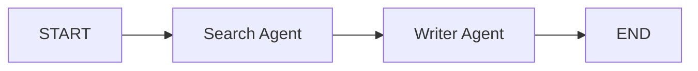

**5 agents (this module's team, plus Planner + Reviewer)** — a single deterministic Supervisor comfortably manages routing across 4-6 specialists; this is the sweet spot for the pattern built in this document.

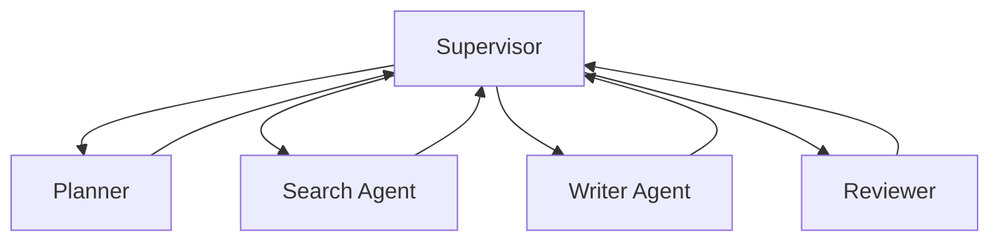

**20 agents** — a flat supervisor over 20 specialists is an anti-pattern (routing prompt/logic becomes unmanageable, and an LLM-driven router's accuracy degrades with option count). Split into **hierarchical teams** of 4-6 agents each, each with its own sub-supervisor, exposed to a top-level supervisor as opaque subgraph nodes — e.g., a "Research Team," a "Writing Team," a "Fact-Checking Team," a "Formatting Team."

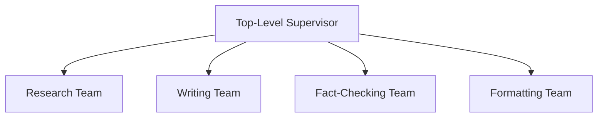

**100 agents** — organizations at this scale (think large agentic coding platforms or enterprise workflow systems) typically move to: (a) multiple hierarchy levels (teams of teams), (b) a **registry/catalog** service that supervisors query dynamically rather than hardcoding member lists in prompts, (c) **capability-based routing** (route by declared skill/tool tags rather than by name), and (d) independent deployment and scaling per team subgraph (each team is its own service, composed at the API layer rather than in a single Python process). At this scale, orchestration itself becomes a piece of infrastructure with its own on-call rotation, not "one more node in a graph."

## Real Industry Examples

The Research Assistant Team built in this module is a small-scale instance of a pattern that recurs, at wildly different scale, across every domain that has adopted agentic AI. In each case below, notice the same two design moves this module made: (1) skills are split into agents along tool-access and audit boundaries, not just along "what feels like a separate step," and (2) a supervisor or fixed pipeline — never direct agent-to-agent calls — owns the control flow.

- **Research** — multi-agent "deep research" products (e.g., search-augmented report generators) split planning, parallel web/document search, and synthesis into distinct agents so the synthesis step never has to also decide *what* to search for mid-write.
- **Customer Support** — a router/triage agent classifies intent (billing, technical, refund) and hands off to specialist agents with scoped tool access (billing agent can issue refunds, technical agent can only read logs) — isolation here is a security boundary, not just an organizational one.
- **Coding Agents** — Planner → Coder → Test-Runner → Reviewer pipelines, often with a supervisor that re-invokes Coder on test failure up to a bounded retry count; subgraphs isolate "edit this file" from "run the whole test suite."
- **Financial Analysis** — parallel `Send()`-style fan-out across data sources (filings, market data, news sentiment) feeding a single aggregation/analyst agent, mirroring this module's map-reduce pattern at a larger scale.
- **Healthcare** — strict separation between an information-retrieval agent (clinical literature lookup) and a drafting agent, with a mandatory human-in-the-loop `interrupt()` before any output reaches a clinician, because the cost of an unreviewed hallucination is unacceptable.
- **Legal** — document review agents (clause extraction, risk flagging) feed a drafting/redlining agent, again gated by mandatory human review — the multi-agent split exists specifically so each stage's output is independently auditable.
- **HR** — resume screening (extraction agent) separated from ranking/recommendation (evaluation agent) separated from scheduling (action agent with calendar tool access) — isolating tool access per agent limits blast radius if any one agent misbehaves.
- **Sales** — lead-research agent (web + CRM lookup) feeding a personalized-outreach-drafting agent, with a supervisor deciding whether enough signal exists to draft outreach at all or whether more research is needed first.
- **Marketing** — content-brief agent → drafting agent → brand-compliance review agent, with the review agent able to route back to drafting (bounded revision loop) rather than ever auto-publishing unreviewed content.

The common thread across every domain: **agents are split along audit and access boundaries as much as along skill boundaries** — a pattern this module's Research Team mirrors at small scale (Search Agent has web-search tool access and nothing else; Writer Agent has zero tool access and can only transform what it's given).

## Exercises

### Beginner (10)
1. Add a `Fact_Checker` node that runs after `writer_agent` and before the Supervisor finalizes; wire it into `supervisor.py`'s routing logic.
2. Add a `revision_count: int` field to `ResearchState` and increment it each time the Supervisor routes back to `writer_agent`.
3. Add a `search_tools` list variation that drops `get_news` and confirm the graph still runs end to end with only `get_google_search`.
4. Add a second question field, `follow_up_question`, and extend the Supervisor to handle a second research pass.
5. Write a unit test asserting `search_agent`'s returned `Command` always has `goto == "supervisor"`.
6. Add structured logging (agent name + timestamp) to each node's entry point.
7. Change the Writer Agent's temperature to `0.0` and observe how output variance changes across three runs with the same input.
8. Add a `sources: list[str]` field to `ResearchState`, populated by the Search Agent, and have the Writer Agent append a "Sources" section using it.
9. Write a test using `FakeListChatModel` to verify the Writer Agent produces a `draft` field from a given `search_results` input.
10. Draw (by hand or Mermaid) the full sequence diagram for a run where the Search Agent's first search fails and it retries once.

### Intermediate (10)
11. Implement a `with_retry` decorator (a new `core/utils/retries.py`) and apply it to `get_google_search`'s `search.results(...)` call.
12. Build a `trim_messages` node that runs before the Supervisor and drops the oldest messages once `len(messages) > 10`.
13. Convert the flat three-node graph into a hierarchical one: wrap `search_agent` + `writer_agent` + their internal supervisor into a compiled subgraph called `research_team`, exposed as one node to a new top-level graph.
14. Add a `Planner` node before the Search Agent that splits a compound question into 2-3 sub-questions stored in `sub_questions: list[str]`.
15. Implement `Send()`-based parallel search: dispatch one `search_agent` invocation per sub-question from exercise 14, and merge results with an `operator.add` reducer.
16. Add a fallback LLM (a cheaper/faster model) that the Writer Agent switches to if the primary model call times out twice.
17. Add an LLM-driven variant of the Supervisor (structured output routing) and write a test comparing its routing decision against the deterministic version on 5 sample states.
18. Instrument the graph with LangSmith tracing and capture a screenshot/description of one full trace showing all three agents.
19. Add a `PostgresSaver` checkpointer (can be a local Docker Postgres) in place of `MemorySaver`, and verify a run survives a process restart mid-graph via `interrupt()`.
20. Write an integration test that mocks all three search providers to fail and asserts the graph still reaches `END` with a degraded-but-non-crashing `final_answer`.

### Advanced (10)
21. Implement full human-in-the-loop: the Writer Agent calls `interrupt()` with the draft, and a CLI script resumes the graph with `Command(resume=True/False)` to approve or request a rewrite.
22. Build a `Reviewer Agent` that grades the draft's factual consistency against `search_results` using structured output (`ConsistencyScore` Pydantic model) and routes back to `writer_agent` if the score is below a threshold, bounded by `revision_count`.
23. Add a second specialist, `Code_Search_Agent` (searches GitHub/StackOverflow instead of the general web), and extend the Supervisor's routing logic to choose between `Search_Agent` and `Code_Search_Agent` based on question content.
24. Build a capability-registry-based router: instead of hardcoding agent names in the Supervisor, load a list of `{name, description, tools}` dicts and have an LLM-driven supervisor pick from that dynamic list.
25. Implement true hierarchical teams: a `Research Team` subgraph and a `Writing Team` subgraph (each with 2+ internal agents and their own mini-supervisor), composed under one top-level `CEO` supervisor.
26. Add cost tracking: a `total_tokens: int` field in state, updated via reducer after every LLM call, with the Supervisor forcing `END` if a token budget is exceeded.
27. Add streaming to the FastAPI app (`app.py`) using `graph.astream_events`, and build a minimal HTML page that shows live "Search Agent is searching..." / "Writer Agent is drafting..." status updates.
28. Implement a caching layer for `get_google_search` (in-memory TTL cache keyed on the query string, per the Performance section) and write a test proving a repeated identical query doesn't hit the network twice.
29. Add a `batch()`-based agent that summarizes a list of 10 documents in one node call rather than looping through the graph 10 times; compare wall-clock time against a naive per-document loop.
30. Design (diagram + written justification) a 20-agent hierarchical system for an "Enterprise Sales Assistant" covering lead research, outreach drafting, meeting scheduling, and CRM updates — identify the team boundaries and what each sub-supervisor owns.

### Architecture Challenges (5)
31. Given a requirement to support both "quick answer" (Search + Writer only) and "deep report" (Planner + parallel Search + Writer + Reviewer) modes from the same codebase, design a graph structure that supports both without duplicating agent code. Justify your approach vs. maintaining two separate graphs.
32. A stakeholder wants the Search Agent's tool access auditable per-request for compliance. Design a state/logging schema that records every tool call, its arguments, and its result, without bloating the `messages` field used for LLM context.
33. Design a graceful-degradation strategy for a Writer Agent whose primary model provider has a full outage: what state transitions, fallback nodes, and user-facing messaging would you implement, and where does the decision to fail over live in the graph?
34. You need to add a "translate the final answer into 5 languages" step. Design it as a `Send()`-based parallel fan-out rather than 5 sequential Writer calls, including how you'd merge 5 independent translations back into one state field.
35. Propose a state-schema versioning strategy for a production graph that has been running with a `PostgresSaver` checkpointer for 6 months, given that you need to add a new required field to `ResearchState` without breaking resumability of in-flight (paused/interrupted) graph runs.

### Debugging Challenges (5)
36. *Scenario:* The Supervisor keeps routing back to `search_agent` in an infinite loop even after `search_results` is populated. *Task:* Identify the likely bug (hint: check for whitespace-only strings passing a falsy check incorrectly, or a reducer silently clearing the field) and fix it.
37. *Scenario:* `messages` in the final state contains only the last message instead of the full conversation history. *Task:* Diagnose the `TypedDict` annotation and fix the missing/incorrect reducer.
38. *Scenario:* A `Send()`-based parallel search fan-out only ever shows the results from one branch in the final state, not all of them. *Task:* Identify the missing/incorrect reducer on the target field and fix it.
39. *Scenario:* A graph using `interrupt()` for human approval loses all state and restarts from scratch every time it's resumed. *Task:* Diagnose the checkpointer configuration (likely a fresh `MemorySaver()` instance per request, or a mismatched `thread_id`) and fix it.
40. *Scenario:* The Writer Agent occasionally produces an answer that contradicts the Search Agent's findings. *Task:* Propose both a prompt-level fix and a structural fix (e.g., a Reviewer/consistency-check node), and explain why relying on prompt wording alone is insufficient at scale.

## Interview Questions

**Q1. What is the core architectural difference between a Chain and a Graph in the LangChain/LangGraph ecosystem?**
A Chain is essentially a DAG — data flows one direction with no cycles. LangGraph explicitly supports cycles, letting agents loop, retry, and revisit earlier steps based on runtime state, which is what makes autonomous, self-correcting agent behavior possible.

**Q2. Why prefer a multi-agent architecture over one large agent with many tools?**
Separation of concerns: smaller, focused prompts avoid tool confusion and context dilution; failures are isolated to one agent instead of derailing the whole run; each agent can be traced, tested, and iterated on independently; and independent sub-tasks can run in parallel.

**Q3. Explain the `Command` object and why it replaced returning a plain dict plus a separate conditional-edge function.**
`Command(update={...}, goto=...)` lets a node express "what changed" and "what happens next" in one return value, colocated with the logic that produced them. This makes routing decisions auditable at the node level instead of split between the node and a separate router function elsewhere in the codebase.

**Q4. When would you choose a deterministic (plain Python) Supervisor over an LLM-driven one?**
Whenever the routing decision can be derived purely from which state fields are already populated or from simple business rules — no semantic judgment required. This saves an LLM call per hop, removes non-determinism from your control flow, and is trivially unit-testable. Reach for an LLM-driven supervisor only when the next step genuinely depends on judging the *content* of what an agent produced.

**Q5. What is a State Reducer, and why does `add_messages` matter?**
By default, a node's returned dict overwrites matching state keys. A reducer (declared via `Annotated[Type, reducer_fn]`) defines how an update combines with existing state instead of replacing it. `add_messages` is the built-in reducer for message lists — it appends (and dedupes/updates by message ID) rather than overwriting, which is essential once multiple agents write to the same `messages` field over a run.

**Q6. When should you use a Subgraph instead of adding more nodes to the flat parent graph?**
When a conceptual step is itself a multi-step process with its own internal state and routing (e.g., an entire "Research Team" with its own supervisor and specialists). Subgraphs encapsulate that complexity behind a single node in the parent, keeping the parent's routing logic — and its LLM-driven supervisor's prompt, if any — comprehensible.

**Q7. How does LangGraph persist and resume conversations across sessions?**
Via a checkpointer (`MemorySaver` for development, `PostgresSaver`/Redis-backed savers for production) keyed by a `thread_id` passed in `config={"configurable": {"thread_id": ...}}`. The checkpointer snapshots state at every node transition, so a later invocation with the same `thread_id` resumes from the last checkpoint rather than starting over.

**Q8. What does `interrupt()` do, and what's required to use it safely in production?**
`interrupt(payload)` pauses graph execution at that exact point and surfaces `payload` to the caller; execution only resumes via `Command(resume=...)` against the same thread. It requires a *persistent* checkpointer — an in-memory one can't survive a process restart while waiting hours or days for a human response, which defeats the purpose.

**Q9. Explain `Send()` and the map-reduce pattern in LangGraph.**
`Send(node_name, payload)` dispatches an independent, concurrent invocation of `node_name` with its own state slice; a node can return a list of `Send(...)` objects to fan out dynamically (the "map"). When all branches complete, their outputs merge back into the parent state via each field's reducer (the "reduce") — e.g., `operator.add` on a list field accumulates one entry per branch.

**Q10. What's the difference between Shared State and Private State, and why does the distinction matter?**
Shared state is visible to every agent in the graph and is the coupling surface between them — it should be minimal. Private state is scoped to one agent's or subgraph's internal reasoning (raw scratch data, unsummarized tool output) and never crosses into the parent/shared schema. Conflating the two means every agent's internal noise ends up in every other agent's context window, inflating cost and confusing downstream reasoning.

**Q11. How do you prevent infinite loops in a Supervisor-based architecture?**
Layer three defenses: (1) LangGraph's `recursion_limit` config as a hard backstop; (2) an explicit `step_count`/`revision_count` field in state checked by the routing logic; (3) for LLM-driven supervisors, structured output constrained to a `Literal[...]` of valid targets, plus explicit termination criteria in the prompt.

**Q12. Why should tool functions catch their own exceptions instead of letting them propagate?**
From the calling agent's point of view, a tool failure is information to reason about ("the search failed, should I retry with a different query or report no results?"), not a program crash. Returning an explanatory string lets the LLM self-correct on its next turn; an uncaught exception crashes the entire graph run.

**Q13. What's wrong with a "Giant Supervisor" that routes, validates, and formats all in one node/prompt?**
It reintroduces the exact problem multi-agent architecture was meant to solve — prompt bloat, tool/responsibility confusion, and an impossible-to-debug single point of failure. Each responsibility (routing, validation, formatting) should be its own node so it can be tested, traced, and modified independently.

**Q14. How would you test a graph node that calls an LLM, without hitting a real API in CI?**
Use a deterministic fake chat model (e.g., `FakeListChatModel`) injected in place of the real client, and assert on the shape of the node's returned `Command` (correct `goto`, correct `update` keys) rather than exact LLM text. Reserve real-API tests for a smaller, separate integration/evaluation suite (e.g., a LangSmith dataset run), not the main CI unit-test path.

**Q15. Describe the failure mode of shared mutable state under parallel `Send()` execution, and how reducers fix it.**
If multiple parallel branches write to a field with default "last write wins" semantics, whichever branch's write lands last silently clobbers the others — a race condition. Declaring the field with an appropriate reducer (e.g., `operator.add` for accumulation) makes the merge behavior explicit and deterministic regardless of completion order.

**Q16. When does a flat Supervisor pattern stop scaling, and what replaces it?**
Once the number of direct specialist reports grows past roughly 6-8, a single supervisor's routing prompt/logic becomes unmanageable and (for LLM-driven supervisors) routing accuracy degrades. The fix is hierarchical composition: group specialists into teams, each with its own sub-supervisor, exposed to a top-level supervisor as single subgraph nodes.

**Q17. What's the difference between transport-level retry and application-level retry, and why do you need both?**
Transport-level retry (e.g., `ChatOpenAI(max_retries=2)`) handles transient network/rate-limit failures on a single API call. Application-level retry (e.g., a `with_retry` decorator around an entire tool call or agent turn) handles higher-level failures like "the search returned nothing useful" that require re-invoking business logic, not just resending the same request.

**Q18. Why is it an anti-pattern for one node to directly import and call another agent's node function instead of returning a `Command`?**
It creates an undocumented, untraceable second control-flow path alongside the graph's actual edges — the graph visualization and LangSmith trace no longer reflect reality, checkpointing/resumability breaks for that path, and the node is no longer a pure, independently testable function of state.

**Q19. How do you decide what fields belong in your `TypedDict` state schema versus being recomputed or stored externally?**
A field belongs in state if a downstream node genuinely needs to read it. Large blobs (full documents, raw API dumps) should live in external storage (S3, a document store) with only a reference/ID in state — state is meant to be the coordination surface between agents, not a general-purpose data lake.

**Q20. What observability setup would you consider non-negotiable before putting a multi-agent LangGraph system into production?**
LangSmith (or equivalent) tracing enabled from day one so every node transition, `Command`, and tool call is inspectable per `thread_id`; structured logging with agent name and step number at each node boundary; and a small evaluation dataset run in CI/CD to catch routing or quality regressions before they reach users — retrofitting any of this after an incident is far more expensive than having it from the start.

## Summary

**Key Takeaways:**
- Multi-agent decomposition solves context dilution, tool confusion, and blast-radius problems that plague monolithic single-agent designs.
- `Command()` unifies state updates and routing decisions in one auditable return value per node — prefer it over split dict-return-plus-conditional-edges routing.
- A deterministic Supervisor should be your default; reach for an LLM-driven one only when routing genuinely requires semantic judgment.
- State design is the architecture: minimal Shared State, well-bounded Private State, and correct reducers are what make multi-agent communication safe and debuggable.
- `Send()` gives you map-reduce parallelism; `interrupt()`/resume gives you durable human-in-the-loop — both require a persistent checkpointer in production.
- Subgraphs and hierarchical teams are how you scale past a handful of agents without the Supervisor itself becoming the new monolith.

**Architecture Recap (Research Assistant Team):**
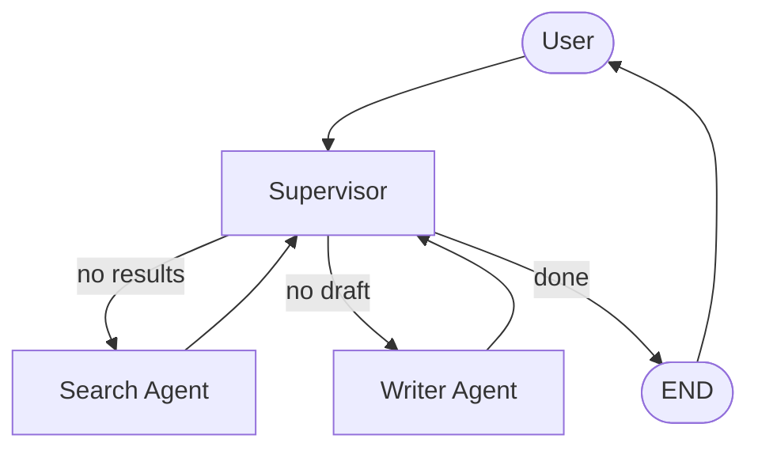

**Common Pitfalls:** the Giant Supervisor, shared mutable state without reducers under parallel execution, unbounded revision loops, hand-rolled tool-call loops in every agent, duplicated prompt boilerplate, and direct agent-to-agent calls that bypass the graph.

**Production Checklist:**
- [ ] Persistent checkpointer (Postgres/Redis) configured, not `MemorySaver`
- [ ] LangSmith (or equivalent) tracing enabled
- [ ] Every tool catches its own exceptions and returns explanatory strings
- [ ] Step/recursion budget enforced beyond just the framework default
- [ ] Secrets loaded from a secrets manager, never committed
- [ ] Unit tests for routing logic, mocked-LLM tests for agent nodes, at least one failure-mode integration test
- [ ] Docker image builds and runs the FastAPI app with streaming enabled
- [ ] CI gate runs the test suite (and, if applicable, a LangSmith evaluation dataset) on every PR

**Design Checklist:**
- [ ] Is my state schema as small as it can be, with private scratch data kept out of it?
- [ ] Does every node's responsibility map to exactly one concern?
- [ ] Would this system still make sense if I had to explain routing to a new engineer in two sentences?
- [ ] Have I chosen deterministic vs. LLM-driven supervision deliberately, not by default?
- [ ] At my current/projected agent count, is a flat Supervisor still appropriate, or is it time for hierarchical teams?

## Next Steps

Week 4 shifts from architecture to **deploying and operating multi-agent systems at scale**: wiring the compiled graph into LangServe/LangGraph Platform, building true token-and-event streaming into a React frontend, setting up CI/CD pipelines gated on LangSmith evaluation thresholds, and standing up webhook-triggered asynchronous graph runs for long-lived, human-in-the-loop workflows. Bring the Research Assistant Team you built here — it's the system you'll deploy, monitor, and scale next.
