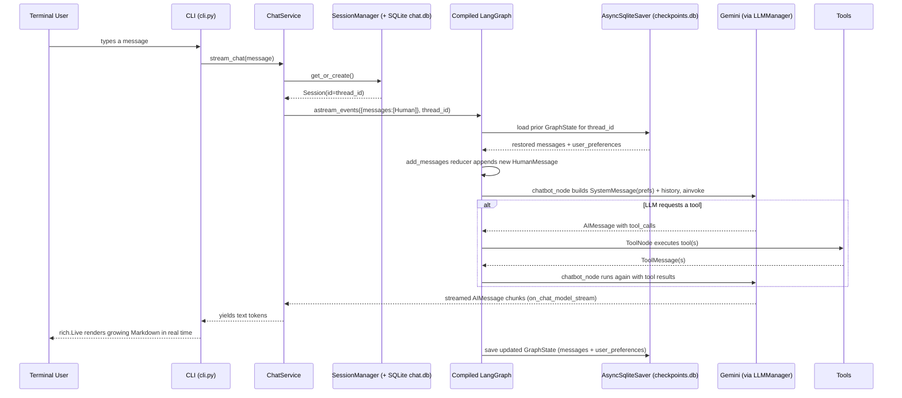

# LangGraph CLI Chat Agent — Complete Project Documentation

This document is the single source of truth for **what has been built, how it works internally, and what is still a scaffold**. It is written so you can explain the project end-to-end — architecture, data flow, and design decisions — without having to re-read the source.

---

## 1. What This Project Is

A terminal-based AI chat agent built on **LangGraph** (stateful agent orchestration), **LangChain** (LLM/tool abstractions), with **SQLite** for both chat-session bookkeeping and LangGraph checkpoint persistence. It supports:

- Multi-turn conversation with memory that survives app restarts
- Tool calling (weather, Google search, news, saving user preferences)
- Streaming token-by-token output rendered live in the terminal with Markdown
- Swappable LLM providers (Google Gemini is wired and active; OpenAI/Anthropic/Groq are supported by the same code path)

It currently runs as a **CLI application only** (`python main.py` / `python app.py`). There is no web API exposed yet (`interfaces/api/` exists only as an empty placeholder folder with a README).

---

## 2. Tech Stack

| Layer | Technology |
|---|---|
| Agent orchestration | LangGraph (`StateGraph`, `ToolNode`, `tools_condition`) |
| LLM abstraction | LangChain (`langchain-core`, provider packages) |
| LLM providers | Google Gemini (active), OpenAI, Anthropic, Groq (all supported via the same manager) |
| Persistence (chat state/memory) | LangGraph `AsyncSqliteSaver` → `data/checkpoints.db` |
| Persistence (session metadata) | SQLAlchemy 2.0 (async) → SQLite (`DATABASE_URL`) |
| Config | `pydantic-settings` reading from `.env` |
| CLI rendering | `rich` (Markdown streaming, live updates, spinners) |
| Tools | `httpx` (weather/OpenWeatherMap), `langchain-community` GoogleSerperAPIWrapper (search), `langchain-tavily` (news) |
| Package/dependency management | `uv` (`pyproject.toml` + `uv.lock`) |

Python **3.14+** is required (`pyproject.toml`).

---

## 3. Project Structure (as it actually stands)

```
app.py                      # real async entrypoint (DB + checkpointer + CLI)
main.py                     # (secondary entrypoint — check contents before using; app.py is the one wired to DI)
config/
  settings.py                # pydantic-settings — reads .env into a typed Settings object
  enums.py                   # LLMProvider, VectorStore, SearchProvider, LogLevel, etc.
  prompts.py                 # (system prompt templates)
  constants.py                # STUB — empty, only TODO comments
core/
  bootstrap.py                # Dependency-injection wiring: builds SessionManager + ChatService
  database/
    base.py                   # SQLAlchemy DeclarativeBase
    db.py                      # async engine + session factory + init_database()
    models/session.py          # SessionModel (SQLAlchemy ORM table "sessions")
    repositories/session_repository.py  # CRUD + get_active_session()
  graph/
    state.py                   # GraphState (LangGraph state schema) — IMPLEMENTED
    graph.py                   # GraphBuilder — wires chatbot + tools nodes — IMPLEMENTED
    nodes.py                   # create_chatbot_node, create_refiner_node — IMPLEMENTED (refiner unused)
    checkpointer.py             # Checkpointer — lifecycle wrapper for AsyncSqliteSaver — IMPLEMENTED
    router.py                   # route_after_chatbot — written but NOT wired into graph.py
  llm/
    manager.py                  # LLMManager — provider factory (Google/OpenAI/Anthropic/Groq) — IMPLEMENTED
    models.py                   # SupportedModel enum — large catalog of model name strings
    formatter.py                 # LLMResponseFormatter.to_text() — implemented, currently unused by chat_service
  memory/
    session.py                   # SessionManager — IMPLEMENTED, used in production path
    history.py                   # HistoryManager — implemented but NOT used (superseded by LangGraph checkpointer)
    summarizer.py                # STUB — empty
    checkpoint.py                 # STUB — empty (real checkpointer lives in core/graph/checkpointer.py)
  tools/
    weather.py                    # get_weather — IMPLEMENTED (OpenWeatherMap)
    search.py                     # get_google_search — IMPLEMENTED (Serper)
    news.py                       # get_news — IMPLEMENTED (Tavily)
    preferences.py                 # save_preference — IMPLEMENTED (intercepted manually, see §6)
    registry.py                    # STUB — empty; tool list is currently hardcoded in graph.py
services/
  chat_service.py                 # ChatService — IMPLEMENTED, the real orchestration bridge
  session_service.py                # STUB — empty (SessionManager in core/memory covers this today)
  memory_service.py                  # STUB — empty
  tool_service.py                     # STUB — empty
interfaces/
  cli/cli.py                        # CLI — IMPLEMENTED, the real REPL loop
  cli/renderer.py                    # CLIRenderer — IMPLEMENTED, rich-based terminal rendering
  api/README.md                       # placeholder only, no code
shared/
  logger.py                           # IMPLEMENTED — RichHandler + rotating file handler
  exceptions.py, decorators.py, helpers.py   # STUBS — empty, TODO only
data/                                  # created at runtime — chat.db, checkpoints.db
graph.png                              # auto-generated Mermaid diagram of the compiled graph (see §5)
docs/                                   # architecture notes and learning roadmap docs
```

**Read this table literally when explaining the project**: several files exist purely as scaffolding (docstring TODOs, no logic). Don't claim summarization, a tool registry, or a REST API exist — they don't yet. The parts that *are* real and running are the graph, the chatbot node, the four tools, the SQLite checkpointer, session metadata storage, and the CLI.

---

## 4. Configuration

`config/settings.py` defines a single `Settings` (pydantic-settings) object loaded once via `get_settings()` (`@lru_cache`) and exported as `settings`. Every field maps to an environment variable (see `.env.example`), covering:

- App identity (`APP_NAME`, `APP_VERSION`, `DEBUG`)
- LLM provider/model/temperature/max_tokens/streaming, plus API keys per provider
- Embeddings + vector store settings (reserved for future RAG work — not yet consumed anywhere)
- Database URLs: `DATABASE_URL` (session metadata) and three separate SQLite paths for checkpoints/sessions/summaries
- Memory limits (`MAX_HISTORY_MESSAGES`, `SUMMARY_TRIGGER_MESSAGES`) — defined but not yet enforced anywhere (no summarizer is wired in)
- Tool API keys (OpenWeatherMap, Serper, Tavily, NewsAPI)
- CLI behavior flags (theme, streaming, show-tool-calls, show-thinking) — `cli_show_tool_calls`/`cli_show_thinking` are read into settings but the renderer doesn't currently branch on them
- Logging (`LOG_LEVEL`, `LOG_FILE`, `LOG_FORMAT`)
- LangSmith tracing toggles (`LANGCHAIN_TRACING_V2`, etc.) — standard LangChain env vars, no custom code needed to activate them
- Session TTL / max sessions — defined but not enforced (no expiry logic implemented yet)

**Important inconsistency to know about:** `core/bootstrap.py` hardcodes the model to `SupportedModel.GEMINI_3_1_FLASH_LITE`, overriding whatever `LLM_MODEL` is set to in `.env` (which defaults to `gemini-2.5-flash`). If you want `.env`'s model to actually take effect, `bootstrap.py` needs to pass `settings.llm_model` instead of the hardcoded enum value.

---

## 5. The LangGraph Core (the heart of the system)

### 5.1 State Schema — `core/graph/state.py`

```python
class GraphState(MessagesState):
    route: str | None
    action: str | None
    user_preferences: Annotated[dict[str, Any], update_preferences]
```

- `MessagesState` (LangGraph built-in) already provides `messages: Annotated[list[BaseMessage], add_messages]`.
- `add_messages` is a **reducer**: when a node returns `{"messages": [new_msg]}`, LangGraph doesn't overwrite the list — it appends. This is what makes conversation history accumulate automatically across graph steps.
- `user_preferences` uses a **custom reducer**, `update_preferences`, which does a shallow dict merge (`{**left, **right}`) instead of appending — so preferences accumulate as key/value overwrites, not a growing list.
- `route` / `action` are declared but not read by the compiled graph today (see §5.4 — `router.py` is not wired in). They're forward-looking fields for a future multi-route graph.

### 5.2 Graph Construction — `core/graph/graph.py` (`GraphBuilder`)

The compiled graph has exactly two nodes:

```
START → chatbot ──(tools_condition)──→ tools → chatbot → ... → END
                 └──(no tool call)───→ END
```

- **`chatbot`**: `create_chatbot_node(llm, tools)` from `nodes.py` — binds the 4 tools to the LLM and runs one reasoning step.
- **`tools`**: LangGraph's prebuilt `ToolNode`, given the same tool list. It executes whichever tool(s) the LLM asked for and returns their results as `ToolMessage`s.
- **Conditional edge**: `tools_condition` (LangGraph prebuilt) inspects the last AI message — if it contains `tool_calls`, route to `"tools"`; otherwise route to `END`.
- **Loop-back edge**: `tools → chatbot` unconditionally, so after a tool runs, the LLM gets to read the result and produce a final answer (or call another tool).
- The graph is compiled with `builder.compile(checkpointer=self._checkpointer)` — this is what gives it automatic state persistence per `thread_id` (see §6).
- As a side effect, every time `GraphBuilder.build()` runs (i.e., every process start), it renders the compiled graph topology to `graph.png` via `draw_mermaid_png()`. This is a debug/visualization aid, not something the runtime depends on.

### 5.3 The Chatbot Node — `core/graph/nodes.py`

```python
def create_chatbot_node(llm, tools):
    tool_enabled_llm = llm.bind_tools(tools)

    async def chatbot_node(state: GraphState):
        messages = state["messages"]
        preferences = state.get("user_preferences", {})
        sys_msg = SystemMessage(content=f"... Remember and use ... {preferences} ...")
        response = await tool_enabled_llm.ainvoke([sys_msg] + messages)
        state_update = {"messages": [response]}
        # manual interception of save_preference tool calls (see §6)
        ...
        return state_update
    return chatbot_node
```

Each turn:
1. Reads the full accumulated message history + current preferences from state.
2. Builds a fresh `SystemMessage` embedding those preferences directly into the prompt — this is how the model "remembers" facts like the user's name across turns, without needing a vector store or RAG.
3. Sends `[system, *history]` to the LLM.
4. Returns the AI's response as a state delta (appended to `messages` by the reducer).

There is also a **`create_refiner_node`** in the same file — an LLM pass intended to polish a final answer after tool use. **It is not added to the graph in `graph.py`.** It exists as prepared-but-unused code (visible in git log as "add refiner node for improved content processing" — the intent was there, the wiring wasn't finished).

### 5.4 Router — `core/graph/router.py`

`route_after_chatbot(state) -> str` simply returns `state["route"]`. This function is **not referenced anywhere else in the codebase** — `graph.py` uses LangGraph's built-in `tools_condition` instead. Treat this as scaffolding for a future, more elaborate routing scheme (e.g., routing to a RAG node or planner node), not as active logic.

---

## 6. Memory — Two Distinct Kinds

This is the most important architectural idea to be able to explain clearly, because there are two separate, independently-persisted things called "memory":

### 6.1 Short-term (in-graph, per-turn) memory

Lives entirely in `GraphState` for the duration of one `astream_events`/`ainvoke` call — the `add_messages` reducer appends the new human message and AI response(s) onto whatever history was loaded into state at the start of the call.

### 6.2 Long-term (cross-restart) memory — the LangGraph Checkpointer

- `core/graph/checkpointer.py`'s `Checkpointer` class wraps `AsyncSqliteSaver.from_conn_string(settings.sqlite_checkpoint_db)`, opened once in `app.py` at startup and closed on shutdown.
- The compiled graph is given this checkpointer (`builder.compile(checkpointer=...)`).
- Every invocation is scoped by a `thread_id`: `config={"configurable": {"thread_id": str(session.id)}}`.
- LangGraph automatically: (a) loads the last saved `GraphState` for that `thread_id` before running the graph, and (b) saves the new `GraphState` after each step. **No custom save/load code was written for this — it's entirely LangGraph's built-in checkpoint mechanism.**
- Effect: close the app, reopen it, and the conversation (including `user_preferences`) picks up exactly where it left off, because `SessionManager.get_or_create()` resolves back to the same `thread_id` (see §7).

### 6.3 User preferences — a mutation, not a log

- `save_preference(key, value)` (`core/tools/preferences.py`) is a normal LangChain `@tool` — it's included in the tools list bound to the LLM, so the model can decide to call it and it shows up structurally as a tool call.
- **However**, it is never actually executed by the `ToolNode`. Instead, `chatbot_node` manually inspects `response.tool_calls` for any call named `save_preference`, pulls out `key`/`value`, and folds them directly into the `user_preferences` state field via the state-update dict.
- Why: this lets preference changes merge into `GraphState.user_preferences` (via the `update_preferences` reducer) rather than becoming a `ToolMessage` in the chat log. The tool's own return string (`"Preference 'x' saved as 'y'."`) is effectively cosmetic — the state mutation is what actually persists.
- Caveat worth knowing: because interception happens in `chatbot_node` and the actual tool is never run through `ToolNode`, the model still expects a `ToolMessage` reply to its `tool_call_id` in a strict OpenAI/Gemini function-calling protocol sense. In practice this works because the next turn's system prompt already reflects the updated preference, but it's a slightly non-standard shortcut rather than the textbook tool-execution path.

### 6.4 What's *not* implemented (despite scaffolding existing)

- **Conversation summarization** (`core/memory/summarizer.py`) — empty stub. `SUMMARY_TRIGGER_MESSAGES`/`MAX_HISTORY_MESSAGES` settings exist but nothing reads them, so history is never trimmed or summarized — it grows unbounded in the checkpoint DB.
- **`HistoryManager`** (`core/memory/history.py`) — a fully coded in-memory (dict-based) history manager, but `chat_service.py` has it commented out entirely. It's dead code today; the checkpointer is the real history store.
- **Session TTL / max-sessions enforcement** — settings exist, no code enforces them.

---

## 7. Session Management — `core/memory/session.py` (`SessionManager`) + `core/database`

This is a **separate SQLite database** (`DATABASE_URL`, default `sqlite:///data/chat.db`) from the checkpoint DB — it only stores session *metadata* (id, title, timestamps, `is_active`), not conversation content.

- `SessionModel` (SQLAlchemy ORM, `core/database/models/session.py`): `id` (UUID string, primary key), `title`, `created_at`, `updated_at`, `is_active`.
- `SessionRepository` (`core/database/repositories/session_repository.py`): async CRUD + `get_active_session()` (most-recently-updated row where `is_active = True`).
- `SessionManager.get_or_create()`:
  1. If a session id is already cached in-process, reuse it.
  2. Otherwise, query the DB for the most recently active session.
  3. If none exists, create a new one (`uuid4()`, title `"New Chat"`).
- This `session.id` becomes the LangGraph `thread_id` — the single link between "which row in `chat.db`" and "which conversation state in `checkpoints.db`".
- `init_database()` (`core/database/db.py`) creates tables via `Base.metadata.create_all` — no migration tool (e.g. Alembic) is used; schema changes would currently require deleting the SQLite file or writing manual migration code.

Note: `services/session_service.py` is an empty stub — session lifecycle (create/list/switch/delete) is actually implemented directly on `SessionManager`, not through that service file.

---

## 8. LLM Layer — `core/llm/manager.py` (`LLMManager`)

A thin factory/wrapper around LangChain chat model classes:

```python
match self._provider:
    case LLMProvider.GOOGLE:    ChatGoogleGenerativeAI(...)
    case LLMProvider.OPENAI:    ChatOpenAI(...)
    case LLMProvider.ANTHROPIC: ChatAnthropic(...)
    case LLMProvider.GROQ:      ChatGroq(...)
```

- Reads `settings.llm_provider` / `settings.llm_model` by default, but both are overridable via constructor args (this is how `bootstrap.py` forces Gemini + a specific model regardless of `.env`).
- Exposes `invoke`, `ainvoke`, `stream`, `astream`, and `bind_tools` — all delegate to the underlying LangChain model, so swapping providers requires zero changes anywhere else in the codebase (the interface is provider-agnostic).
- `core/llm/models.py` (`SupportedModel`) is a large `StrEnum` catalog of model name strings across Google/OpenAI/Anthropic/Mistral/Groq — used purely for type-safe naming, not a capability registry (no context-window/cost metadata is attached despite the file's header comment suggesting that was planned).
- `core/llm/formatter.py` (`LLMResponseFormatter.to_text`) normalizes a `BaseMessage.content` (which can be a plain string for OpenAI-style responses or a list of content blocks for Gemini-style responses) into plain text. It's implemented and correct, but currently unused — the real code path streams tokens directly (see §9) rather than formatting a final message.

---

## 9. Tools

All four tools are plain LangChain `@tool`-decorated async functions, hardcoded into a list in `GraphBuilder.build()` (`core/tools/registry.py` — the "registry" file — is an empty stub; there's no dynamic tool registration today).

| Tool | File | Backend | Notes |
|---|---|---|---|
| `get_weather(city)` | `core/tools/weather.py` | OpenWeatherMap REST API via `httpx` | Handles 404 (city not found) and network errors gracefully; returns a formatted emoji summary string |
| `get_google_search(topic)` | `core/tools/search.py` | Serper.dev via `GoogleSerperAPIWrapper` (langchain-community) | Returns raw structured search results dict |
| `get_news(topic)` | `core/tools/news.py` | Tavily via `langchain-tavily`'s `TavilySearch` | Wraps the query as `"Latest news about {topic}"`; catches and returns exceptions as strings |
| `save_preference(key, value)` | `core/tools/preferences.py` | none — pure state mutation | See §6.3 for how it's actually applied (interception in `chatbot_node`, not `ToolNode` execution) |

Tool-calling mechanics (LangGraph's standard pattern, used as-is):
1. `llm.bind_tools(tools)` attaches JSON schemas (auto-derived from each tool's type hints + docstring) to the model request.
2. The LLM may respond with `tool_calls` instead of/alongside text.
3. `tools_condition` routes to the `ToolNode` when `tool_calls` is non-empty.
4. `ToolNode` executes the actual Python function(s), wraps each result as a `ToolMessage` tied to the originating `tool_call_id`, and the graph loops back to `chatbot` so the model can read results and produce a final answer.

---

## 10. Services Layer — `services/`

Only **`ChatService`** (`services/chat_service.py`) is implemented; it's the orchestration bridge between the CLI and the compiled graph.

- `__init__`: takes an `LLMManager`, `SessionManager`, and the checkpointer, and builds the compiled graph once via `GraphBuilder(llm, checkpointer=checkpointer).build()`.
- `stream_chat(user_message)` — **the method actually used by the CLI**:
  1. Validates the message isn't empty.
  2. Resolves the current session via `SessionManager.get_or_create()`.
  3. Calls `self._graph.astream_events({"messages": [HumanMessage(...)]}, config={"configurable": {"thread_id": ...}}, version="v2")`.
  4. Filters for `on_chat_model_stream` events and yields text chunks as they arrive (handling both plain-string and Gemini's list-of-content-block chunk shapes).
- `chat(user_message)` — a non-streaming alternative using `ainvoke` instead of `astream_events`. Fully implemented but **not called by the CLI today** (the CLI always streams). Kept as an alternate/simpler code path, e.g., for a future non-interactive API mode.
- `get_response(message)` — buffers `stream_chat` into a single string. Also not currently called by the CLI.

`session_service.py`, `memory_service.py`, `tool_service.py` are all empty stubs — their responsibilities are currently absorbed by `SessionManager` and the graph/tools system directly, without a dedicated service-layer wrapper.

---

## 11. CLI Interface — `interfaces/cli/`

- **`cli.py`** (`CLI.run()`): a plain synchronous `input()` REPL loop wrapped in `asyncio`:
  1. Print banner.
  2. Loop: read a line, exit on `exit`/`quit`/`close`, otherwise call `renderer.start_assistant_message()`, stream tokens from `chat_service.stream_chat(...)` into `renderer.stream_token(...)`, then `renderer.finish_assistant_message()`.
  3. `KeyboardInterrupt` and generic exceptions are caught per-turn so one bad turn doesn't crash the whole session.
- **`renderer.py`** (`CLIRenderer`): built on `rich`.
  - `start_assistant_message()`/`stream_token()`/`finish_assistant_message()` use a `rich.live.Live` view re-rendering accumulated Markdown ~30x/sec — this is what gives the "typing" streaming effect while still rendering full Markdown formatting (bold, code blocks, etc.) as it grows.
  - Also has (defined but not all actively called from `cli.py`) helpers: `print_user_message`, `print_tool`, `print_session`, `print_system_message`, `print_error`, `status()`, `separator()`, `clear()` — available for a more elaborate CLI (e.g. showing tool-call activity or session IDs) but the current `cli.py` loop keeps things minimal (banner → stream → error handling only).

---

## 12. End-to-End Flow (what actually happens per message)



Special case — **saving a preference**: if the LLM's tool call is `save_preference`, `chatbot_node` short-circuits: it never reaches `ToolNode`, and instead merges `{key: value}` straight into `state["user_preferences"]` via the `update_preferences` reducer, so the *next* turn's system prompt already contains it.

---

## 13. Setup & Running

```bash
# 1. Install dependencies (uv is the project's package manager)
uv sync

# 2. Configure environment
cp .env.example .env
# then fill in at minimum: GOOGLE_API_KEY, LLM_MODEL, DATABASE_URL,
# CHECKPOINT_DB_PATH, SESSION_DB_PATH, and whichever tool API keys you want
# (OPENWEATHER_API_KEY, SERPER_API_KEY, TAVILY_API_KEY)

# 3. Run
python app.py
```

- On first run, `init_database()` creates `data/chat.db` (session metadata tables) and the checkpointer creates `data/checkpoints.db` (LangGraph state).
- `graph.png` is (re)written on every startup showing the compiled graph topology — useful to show visually when explaining the architecture.
- Type `exit`, `quit`, or `close` to end the session; `Ctrl+C` also exits cleanly.

Note: `main.py` also exists in the repo root but is just the unmodified `uv init` placeholder (`print("Hello from langgraph-cli-chat-agent!")`) — it is not part of the application. **`app.py` is the real entrypoint.**

---

## 14. Known Gaps / Inconsistencies Worth Mentioning When Explaining This

Being upfront about these shows a complete understanding of the system rather than an idealized one:

1. **Model override mismatch**: `bootstrap.py` hardcodes `GEMINI_3_1_FLASH_LITE`, ignoring `.env`'s `LLM_MODEL`.
2. **Refiner node built, not wired**: `create_refiner_node` exists in `nodes.py` but `graph.py` never adds it as a graph node.
3. **Router built, not wired**: `route_after_chatbot` in `router.py` is dead code; the graph uses LangGraph's built-in `tools_condition` instead.
4. **No summarization**: history grows unboundedly in the checkpoint DB; `summarizer.py` is an empty stub despite settings for it existing.
5. **`save_preference` isn't executed as a real tool call** — it's manually intercepted in `chatbot_node`, which is a pragmatic but non-standard shortcut (see §6.3).
6. **Several stub files** (`services/session_service.py`, `services/memory_service.py`, `services/tool_service.py`, `core/tools/registry.py`, `core/memory/checkpoint.py`, `core/memory/summarizer.py`, `shared/exceptions.py`, `shared/decorators.py`, `shared/helpers.py`, `config/constants.py`) contain only header-comment TODOs — no logic. Their intended responsibilities are currently handled inline elsewhere (or not yet handled at all).
7. **No REST API**: `interfaces/api/` is a placeholder folder — this is a CLI-only app today.
8. **No automated tests currently present** in the working tree (a `tests/` folder existed with a basic LLM test but has since been removed locally — check `git status` if you need it back).
9. **No DB migrations**: `Base.metadata.create_all` only creates tables that don't exist; schema changes to `SessionModel` won't auto-migrate existing `chat.db` files.

---

## 15. Suggested Next Steps (if continuing this build)

- Wire `settings.llm_model` through in `bootstrap.py` instead of the hardcoded enum.
- Either wire `refiner_node` into the graph (as a post-tool-loop polishing step) or delete it to reduce confusion.
- Implement `summarizer.py` and enforce `MAX_HISTORY_MESSAGES`/`SUMMARY_TRIGGER_MESSAGES` so checkpoint state doesn't grow unbounded.
- Decide whether `save_preference` should become a real `ToolNode`-executed tool (returning a proper `ToolMessage`) instead of manual interception, for stricter protocol compliance.
- Flesh out `core/tools/registry.py` if tools are expected to grow — a dynamic registry avoids hardcoding the tool list inside `GraphBuilder`.
- Add Alembic (or similar) if the session schema is expected to evolve.
- Add tests back, especially around `SessionManager`, `GraphBuilder`, and tool functions (mocking external APIs).
